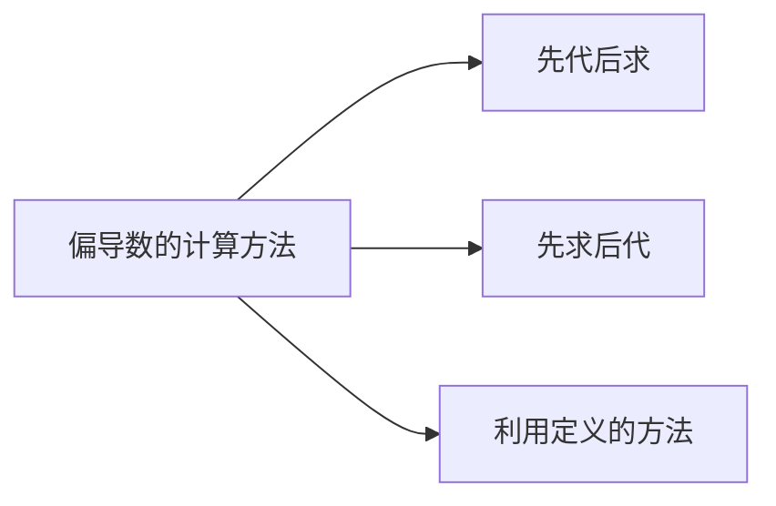

## 一、偏导数定义及其计算法

引例：研究弦在点 $x_{0}$ 处的振动速度与加速度，就是将振幅 $u(x, t)$ 中的 $\boldsymbol{x}$ 固定于 $\boldsymbol{x}_{\mathbf{0}}$ 处，求 $u\left(x_{0}, t\right)$ 关于 $\boldsymbol{t}$ 的一阶导数与二阶导数．

---

## 1.偏导数的定义

设 $z=f(x, y), \quad P_{0}\left(x_{0}, y_{0}\right)$ ，
给 $x$ 以增量 $\Delta x$ ，即由 $P_{0}\left(x_{0}, y_{0}\right) \rightarrow P\left(x_{0}+\Delta x, y_{0}\right)$ ，则得 $\Delta_{x} z=f\left(x_{0}+\Delta x, y_{0}\right)-f\left(x_{0}, y_{0}\right)$ ；
给 $y$ 以增量 $\Delta y$ ，即由 $P_{0}\left(x_{0}, y_{0}\right) \rightarrow P\left(x_{0}, y_{0}+\Delta y\right)$ ，则得 $\Delta_{y} z=f\left(x_{0}, y_{0}+\Delta y\right)-f\left(x_{0}, y_{0}\right)$ ；

定义 若 $\lim _{\Delta x \rightarrow 0} \frac{\Delta_{x} z}{\Delta x}=\lim _{\Delta x \rightarrow 0} \frac{f\left(x_{0}+\Delta x, y_{0}\right)-f\left(x_{0}, y_{0}\right)}{\Delta x}$ 存在，则称此极限值为 $z=f(x, y)$ 在 $\left(x_{0}, y_{0}\right)$ 处对 $x$ 的偏导数。

记为 $\left.\frac{\partial z}{\partial x}\right|_{\substack{x=x_{0} \\ y=y_{0}}},\left.\frac{\partial f}{\partial x}\right|_{\substack{x=x_{0} \\ y=y_{0}}},\left.z_{x}\right|_{\substack{x=x_{0} \\ y=y_{0}}}, f_{x}\left(x_{0}, y_{0}\right),\left.z_{x}^{\prime}\right|_{\substack{x=x_{0} \\ y=y_{0}}}, f_{x}^{\prime}\left(x_{0}, y_{0}\right)$
注意：
（1）$z=f(x, y)$ 在 $\left(x_{0}, y_{0}\right)$ 处对 $y$ 的偏导数为

$$
\lim _{\Delta y \rightarrow 0} \frac{\Delta_{y} z}{\Delta y}=\lim _{\Delta y \rightarrow 0} \frac{f\left(x_{0}, y_{0}+\Delta y\right)-f\left(x_{0}, y_{0}\right)}{\Delta y}
$$

记为 $\left.\frac{\partial z}{\partial y}\right|_{\substack{x=x_{0} \\ y=y_{0}}},\left.\frac{\partial f}{\partial y}\right|_{\substack{x=x_{0} \\ y=y_{0}}},\left.z_{y}\right|_{\substack{x=x_{0} \\ y=y_{0}}}, f_{y}\left(x_{0}, y_{0}\right),\left.z_{y}^{\prime}\right|_{\substack{x=x_{0} \\ y=y_{0}}}, f_{y}^{\prime}\left(x_{0}, y_{0}\right)$
（2）$u=f(x, y, z)$ 在 $\left(x_{0}, y_{0}, z_{0}\right)$ 处的偏导数为

$$
\begin{aligned}
f_{x}\left(x_{0}, y_{0}, z_{0}\right) & =\lim _{\Delta x \rightarrow 0} \frac{f\left(x_{0}+\Delta x, y_{0}, z_{0}\right)-f\left(x_{0}, y_{0}, z_{0}\right)}{\Delta x} \\
\left.\frac{\partial u}{\partial y}\right|_{\substack{x=x_{0} \\
y=y_{0} \\
z=z_{0}}} & =\lim _{\Delta y \rightarrow 0} \frac{f\left(x_{0}, y_{0}+\Delta y, z_{0}\right)-f\left(x_{0}, y_{0}, z_{0}\right)}{\Delta y} \\
\left.u_{z}\right|_{\substack{x=x_{0} \\
y=y_{0} \\
z=z_{0}}} & =\lim _{\Delta z \rightarrow 0} \frac{f\left(x_{0}, y_{0}, z_{0}+\Delta z\right)-f\left(x_{0}, y_{0}, z_{0}\right)}{\Delta z}
\end{aligned}
$$

（3）若 $z=f(x, y)$ 在 $D$ 内每一点的偏导数存在，则称这个偏导数为偏导函数。记为

$$
\frac{\partial z}{\partial x}, \frac{\partial f}{\partial x}, z_{x}, f_{x}(x, y) ; \frac{\partial z}{\partial y}, \frac{\partial f}{\partial y}, z_{y}, f_{y}(x, y)
$$

$\therefore z=f(x, y)$ 在 $\left(x_{0}, y_{0}\right)$ 处的偏导数就是偏导函数在 $\left(x_{0}, y_{0}\right)$ 的函数值．
（4）令 $\Delta x=x-x_{0}, \Delta y=y-y_{0}$ ，则

$$
\begin{aligned}
f_{x}\left(x_{0}, y_{0}\right) & =\lim _{x \rightarrow x_{0}} \frac{f\left(x, y_{0}\right)-f\left(x_{0}, y_{0}\right)}{x-x_{0}} \\
f_{y}\left(x_{0}, y_{0}\right) & =\lim _{y \rightarrow y_{0}} \frac{f\left(x_{0}, y\right)-f\left(x_{0}, y_{0}\right)}{y-y_{0}}
\end{aligned}
$$

2．偏导数的计算
求 $\frac{\partial f}{\partial x}$ 时，把 $y$ 看作常数而对 $x$ 求导；
求 $\frac{\partial f}{\partial y}$ 时，把 $x$ 看作常数而对 $y$ 求导．

例 1 求 $z=x^{2}+3 x y+y^{2}$ 在点 $(1,2)$ 处的偏导数。
例2 设 $f(x, y)=x+(y-1) \arcsin \sqrt{\frac{x}{y}}$ ，求 $f_{x}(x, 1)$ ．例3设 $u=x^{\bar{z}}$ ，求 $u_{x}, u_{y}, u_{z}$ ．

例 4 已知理想气体的状态方程 $p V=R T$ （ $R$ 为常数），求证：$\frac{\partial p}{\partial V} \cdot \frac{\partial V}{\partial T} \cdot \frac{\partial T}{\partial p}=-1$ ．

例 1 求 $z=x^{2}+3 x y+y^{2}$ 在点 $(1,2)$ 处的偏导数．
解法1 $\quad \frac{\partial z}{\partial x}=2 x+3 y ; \quad \frac{\partial z}{\partial y}=3 x+2 y$ 。

$$
\begin{aligned}
\therefore & \left.\frac{\partial z}{\partial x}\right|_{\substack{x=1 \\
y=2}}=2 \times 1+3 \times 2=8, \\
& \left.\frac{\partial z}{\partial y}\right|_{\substack{x=1 \\
y=2}}=3 \times 1+2 \times 2=7 .
\end{aligned}
$$

解法2 $\because z(x, 2)=x^{2}+6 x+4, \quad z(1, y)=1+3 y+y^{2}$ ，

$$
\left.\therefore \frac{\partial z}{\partial x}\right|_{\substack{x=1 \\ y=2}}=\left.(2 x+6)\right|_{x=1}=8,\left.\quad \frac{\partial z}{\partial y}\right|_{\substack{x=1 \\ y=2}}=\left.(3+2 y)\right|_{y=2}=7 \text {. }
$$

例2 设 $f(x, y)=x+(y-1) \arcsin \sqrt{\frac{x}{y}}$ ，求 $f_{x}(x, 1)$ ．
解

$$
\because f(x, 1)=x, \therefore f_{x}(x, 1)=1 \text {. }
$$

例3 设 $u=x^{\bar{z}}$ ，求 $u_{x}, u_{y}, u_{z}$ ．
解 $u_{x}=\frac{y}{z} x^{\frac{y}{z}-1}$ ，

$$
\begin{aligned}
& u_{y}=x^{\frac{y}{z}} \ln x \cdot\left(\frac{y}{z}\right)_{y}^{\prime}=\frac{1}{z} x^{\frac{y}{z}} \ln x, \\
& u_{z}=x^{\frac{y}{z}} \ln x \cdot\left(\frac{y}{z}\right)_{z}^{\prime}=-\frac{y}{z^{2}} x^{\frac{y}{z}} \ln x .
\end{aligned}
$$

例 $\mathbf{4}$ 已知理想气体的状态方程 $\boldsymbol{p} \boldsymbol{V}=\boldsymbol{R} \boldsymbol{T}$ （ $R$ 为常数），求证：$\frac{\partial p}{\partial V} \cdot \frac{\partial V}{\partial T} \cdot \frac{\partial T}{\partial p}=-1$ ．

证

$$
\begin{gathered}
p=\frac{R T}{V} \Rightarrow \frac{\partial p}{\partial V}=-\frac{R T}{V^{2}} ; \\
V=\frac{R T}{p} \Rightarrow \frac{\partial V}{\partial T}=\frac{R}{p} ; \quad T=\frac{p V}{R} \Rightarrow \frac{\partial T}{\partial p}=\frac{V}{R} ; \\
\therefore \frac{\partial p}{\partial V} \cdot \frac{\partial V}{\partial T} \cdot \frac{\partial T}{\partial p}=-\frac{R T}{V^{2}} \cdot \frac{R}{p} \cdot \frac{V}{R}=-\frac{R T}{p V}=-1 .
\end{gathered}
$$

---

## 注意：

（1）偏导数 $\frac{\partial u}{\partial x}$ 是一个整体记号，不能拆分；
（2）求分界点、不连续点处的偏导数要用定义求．

例如 设 $z=f(x, y)=\sqrt{|x y|}$ ，求 $f_{x}(0,0), f_{y}(0,0)$ ．
解 $f_{x}(0,0)=\lim _{x \rightarrow 0} \frac{\sqrt{|x \cdot 0|}-0}{x}=0=f_{y}(0,0)$ ．

---

## 3.偏导数的几何意义

$f_{x}\left(x_{0}, y_{0}\right)$ 是 $z=f\left(x, y_{0}\right)$ 在 $x_{0}$ 处的导数，而 $z=f\left(x, y_{0}\right)$ 是 $z=f(x, y)$ 与 $y=y_{0}$ 的交线。

故偏导数 $f_{x}\left(x_{0}, y_{0}\right)$就是曲面被平面 $y=y_{0}$ 所截得 的曲线在点 $M_{0}$ 处的切线 $M_{0} T_{x}$ 对 $x$ 轴的斜率。

同理，偏导数 $f_{y}\left(x_{0}, y_{0}\right)$ 就是曲面被平面 $x=x_{0}$ 所截得的曲线在点 $M_{0}$ 处的切线 $M_{0} T_{y}$ 对 $y$ 轴的斜率．

4．偏导数存在与函数连续的关系
一元函数中在某点可导 →连续，
多元函数中在某点偏导数存在 ？连续，
例如，函数 $f(x, y)=\left\{\begin{array}{ll}\frac{x y}{x^{2}+y^{2}}, & x^{2}+y^{2} \neq 0 \\ 0, & x^{2}+y^{2}=0\end{array}\right.$ ，
依定义知在 $(\mathbf{0 , 0})$ 处， $\boldsymbol{f}_{\boldsymbol{x}}(\mathbf{0 , 0})=\boldsymbol{f}_{\boldsymbol{y}}(\mathbf{0 , 0})=\mathbf{0}$ ．
但函数在该点处并不连续．偏导数存在 → 连续．

---

## 1.高阶偏导数定义

设 $z=f(x, y)$ 在域 $D$ 内存在连续的偏导数

$$
\frac{\partial z}{\partial x}=f_{x}(x, y), \quad \frac{\partial z}{\partial y}=f_{y}(x, y)
$$

若这两个偏导数仍存在偏导数，则称它们是 $z=f(x, y)$的二阶偏导数．按求导顺序不同，有四个二阶偏导数：

$$
\begin{aligned}
& \frac{\partial}{\partial x}\left(\frac{\partial z}{\partial x}\right)=\frac{\partial^{2} z}{\partial x^{2}}=f_{x x}(x, y) ; \quad \frac{\partial}{\partial y}\left(\frac{\partial z}{\partial x}\right)=\frac{\partial^{2} z}{\partial x \partial y}=f_{x y}(x, y) \\
& \frac{\partial}{\partial x}\left(\frac{\partial z}{\partial y}\right)=\frac{\partial^{2} z}{\partial y \partial x}=f_{y x}(x, y) ; \frac{\partial}{\partial y}\left(\frac{\partial z}{\partial y}\right)=\frac{\partial^{2} z}{\partial y^{2}}=f_{y y}(x, y)
\end{aligned}
$$

即

$$
\left.\begin{array}{l}
\frac{\partial^{2} z}{\partial x^{2}}=f_{x x}(x, y)=f_{x x}^{\prime \prime}(x, y)=\frac{\partial}{\partial x}\left(\frac{\partial z}{\partial x}\right) \\
\frac{\partial^{2} z}{\partial x \partial y}=f_{x y}(x, y)=f_{x y}^{\prime \prime}(x, y)=\frac{\partial}{\partial y}\left(\frac{\partial z}{\partial x}\right) \\
\frac{\partial^{2} z}{\partial y \partial x}=f_{y x}(x, y)=f_{y x}^{\prime \prime}(x, y)=\frac{\partial}{\partial x}\left(\frac{\partial z}{\partial y}\right)
\end{array}\right\} \text { 混合偏导 纯偏导 }
$$

类似可以定义更高阶的偏导数。
例如，$z=f(x, y)$ 关于 $x$ 的三阶偏导数为

$$
\frac{\partial}{\partial x}\left(\frac{\partial^{2} z}{\partial x^{2}}\right)=\frac{\partial^{3} z}{\partial x^{3}}
$$

$z=f(x, y)$ 关于 $x$ 的 $n-1$ 阶偏导数，再关于 $y$ 的一阶偏导数为

$$
\frac{\partial}{\partial y}\left(\frac{\partial^{n-1} z}{\partial x^{n-1}}\right)=\frac{\partial^{n} z}{\partial x^{n-1} \partial y}
$$

---

## 2.高阶偏导数计算习例

例5 设 $z=x^{3} y^{2}-3 x y^{3}-x y+1$ ，

$$
\text { 求 } \frac{\partial^{2} z}{\partial x^{2}} 、 \frac{\partial^{2} z}{\partial y \partial x} 、 \frac{\partial^{2} z}{\partial x \partial y} 、 \frac{\partial^{2} z}{\partial y^{2}} \text { 及 } \frac{\partial^{3} z}{\partial x^{3}} \text {. }
$$

例6 求函数 $z=e^{x+2 y}$ 的二阶偏导及 $\frac{\partial^{3} z}{\partial y \partial x^{2}}$ ．

例5 设 $z=x^{3} y^{2}-3 x y^{3}-x y+1$ ，

$$
\text { 求 } \frac{\partial^{2} z}{\partial x^{2}}, \frac{\partial^{2} z}{\partial y \partial x}, \frac{\partial^{2} z}{\partial x \partial y}, \frac{\partial^{2} z}{\partial y^{2}} \text { 及 } \frac{\partial^{3} z}{\partial x^{3}} \text {. }
$$

解 $\frac{\partial z}{\partial x}=3 x^{2} y^{2}-3 y^{3}-y, \frac{\partial z}{\partial y}=2 x^{3} y-9 x y^{2}-x$ ；

$$
\begin{aligned}
& \frac{\partial^{2} z}{\partial x^{2}}=6 x y^{2}, \quad \frac{\partial^{3} z}{\partial x^{3}}=6 y^{2}, \quad \frac{\partial^{2} z}{\partial y^{2}}=2 x^{3}-18 x y ; \\
& \frac{\partial^{2} z}{\partial x \partial y}=6 x^{2} y-9 y^{2}-1, \quad \frac{\partial^{2} z}{\partial y \partial x}=6 x^{2} y-9 y^{2}-1 .
\end{aligned}
$$

例6 求函数 $z=e^{x+2 y}$ 的二阶偏导数及 $\frac{\partial^{3} z}{\partial y \partial x^{2}} \cdot$

$$
\text { 解 } \begin{aligned}
& \hline \frac{\partial z}{\partial x}=e^{x+2 y} \frac{\partial z}{\partial y}=2 e^{x+2 y} \\
& \frac{\partial^{2} z}{\partial x^{2}}=e^{x+2 y} \frac{\partial^{2} z}{\partial x \partial y}=2 e^{x+2 y} \\
& \frac{\partial^{2} z}{\partial y \partial x}=2 e^{x+2 y} \frac{\partial^{2} z}{\partial y^{2}}=4 e^{x+2 y} \\
& \frac{\partial^{3} z}{\partial y \partial x^{2}}=\frac{\partial}{\partial x}\left(\frac{\partial^{2} z}{\partial y \partial x}\right)=2 e^{x+2 y}
\end{aligned}
$$

注意 ：此处 $\frac{\partial^{2} z}{\partial x \partial y}=\frac{\partial^{2} z}{\partial y \partial x}$ ，但这一结论并不总成立．
／o
例如，$f(x, y)= \begin{cases}x y \frac{x^{2}-y^{2}}{x^{2}+y^{2}}, & x^{2}+y^{2} \neq 0 \\ 0, & x^{2}+y^{2}=0\end{cases}$

$$
\left.\begin{array}{l}
f_{x}(x, y)= \begin{cases}\sqrt{y \frac{x^{4}+4 x^{2} y^{2}-y^{4}}{\left(x^{2}+y^{2}\right)^{2}}}, & x^{2}+y^{2} \neq 0 \\
0, & x^{2}+y^{2}=0\end{cases} \\
f_{y}(x, y)= \begin{cases}\frac{x x^{4}-4 x^{2} y^{2}-y^{4}}{\left(x^{2}+y^{2}\right)^{2}}, & x^{2}+y^{2} \neq 0 \\
0, & x^{2}+y^{2}=0\end{cases} \\
\left.f_{x y}(0,0)=\lim _{\Delta y \rightarrow 0} \frac{f_{x}(0, \Delta y)-f_{x}(0,0)}{\Delta y}=\lim _{\Delta y \rightarrow 0} \frac{-\Delta y}{\Delta y}=-1\right\} \text { 者 } \\
f_{y x}(0,0)=\lim _{\Delta x \rightarrow 0} f_{y}(\Delta x, 0)-f_{y}(0,0)=\lim _{\Delta x \rightarrow 0} \frac{\Delta x}{\Delta x}=1
\end{array}\right\} \begin{gathered}
\text { 等 } \\
\Delta x
\end{gathered}
$$

定理。若 $f_{x y}(x, y)$ 和 $f_{y x}(x, y)$ 都在点 $\left(x_{0}, y_{0}\right)$ 连续，则

$$
f_{x y}\left(x_{0}, y_{0}\right)=f_{y x}\left(x_{0}, y_{0}\right)
$$

本定理对 $\boldsymbol{n}$ 元函数的高阶混合导数也成立。
例如，对三元函数 $u=f(x, y, z)$ ，当三阶混合偏导数在点 $(x, y, z)$ 连续时，有

$$
\begin{aligned}
& f_{x y z}(x, y, z)=f_{y z x}(x, y, z)=f_{z x y}(x, y, z) \\
= & f_{x z y}(x, y, z)=f_{y x z}(x, y, z)=f_{z y x}(x, y, z)
\end{aligned}
$$

说明：因为初等函数的偏导数仍为初等函数，而初等函数在其定义区域内是连续的，故求初等函数的高阶导数可以选择方便的求导顺序．

证：令 $F(\Delta x, \Delta y)=f\left(x_{0}+\Delta x, y_{0}+\Delta y\right)-f\left(x_{0}+\Delta x, y_{0}\right)$

$$
-f\left(x_{0}, y_{0}+\Delta y\right)+f\left(x_{0}, y_{0}\right)
$$

令 $\quad \phi(x)=f\left(x, y_{0}+\Delta y\right)-f\left(x, y_{0}\right)$

$$
\psi(y)=f\left(x_{0}+\Delta x, y\right)-f\left(x_{0}, y\right)
$$

则 $F(\Delta x, \Delta y)=\phi\left(x_{0}+\Delta x\right)-\phi\left(x_{0}\right)$

$$
\begin{aligned}
& =\phi^{\prime}\left(x_{0}+\theta_{1} \Delta x\right) \Delta x-\quad\left(0<\theta_{1}<1\right) \\
& =\left[f_{x}\left(x_{0}+\theta_{1} \Delta x, y_{0}+\Delta y\right)-f_{x}\left(x_{0}+\theta_{1} \Delta x, y_{0}\right)\right] \Delta x \\
& =f_{x y}\left(x_{0}+\theta_{1} \Delta x, y_{0}+\theta_{2} \Delta y\right) \Delta x \Delta y \quad\left(0<\theta_{1}, \theta_{2}<1\right)
\end{aligned}
$$

同样 $F(\Delta x, \Delta y)=f\left(x_{0}+\Delta x, y_{0}+\Delta y\right)-f\left(x_{0}+\Delta x, y_{0}\right)$

$$
\begin{aligned}
& \quad-f\left(x_{0}, y_{0}+\Delta y\right)+f\left(x_{0}, y_{0}\right) \\
& =\psi\left(y_{0}+\Delta y\right)-\psi\left(y_{0}\right) \\
& =f_{y x}\left(x_{0}+\theta_{3} \Delta x, y_{0}+\theta_{4} \Delta y\right) \Delta x \Delta y \\
& \quad\left(x_{0}+\theta_{1} \Delta x, y_{0}+\theta_{2} \Delta y\right) \\
& \quad=f_{y x}\left(x_{0}+\theta_{3} \Delta x, y_{0}+\theta_{4} \Delta y\right)
\end{aligned}
$$

因 $f_{x y}(x, y), f_{y x}(x, y)$ 在点 $\left(x_{0}, y_{0}\right)$ 连续，故令 $\Delta x \rightarrow 0$ ， $\Delta y \rightarrow 0$ 得 $\quad f_{x y}\left(x_{0}, y_{0}\right)=f_{y x}\left(x_{0}, y_{0}\right)$

例7 证明函数 $u=\frac{1}{r}, r=\sqrt{x^{2}+y^{2}+z^{2}}$ 满足拉普拉斯方程 $\frac{\partial^{2} u}{\partial x^{2}}+\frac{\partial^{2} u}{\partial y^{2}}+\frac{\partial^{2} u}{\partial z^{2}}=0$.

例8 设 $f(x, y, z)=x \sin (y z)-z \ln (x y)$ ，求证 $f_{x y z}=f_{z y x}$ ．例9 设 $z=x^{2} y^{2}+x+\sin y+3$ ，求全部二阶偏导和 $\frac{\partial^{3} z}{\partial x^{3}}$ 。

例10 设 $z=x^{y}(x>0, x \neq 1)$ ，求证 $\frac{x}{y} \frac{\partial z}{\partial x}+\frac{1}{\ln x} \frac{\partial z}{\partial y}=2 z$ ．

例11 设 $z=\arcsin \frac{x}{\sqrt{x^{2}+y^{2}}}$ ，求 $\frac{\partial z}{\partial x}, ~ \frac{\partial z}{\partial y}$ ．
例12 设 $z=f(u)$ ，方程 $u=\varphi(u)+\int_{y}^{x} p(t) d t$ 确定 $u$ 是 $x, y$的函数，其中 $f(u), \varphi(u)$ 可微，$p(t), \varphi^{\prime}(u)$ 连续，且 $\varphi^{\prime}(u) \neq 1$ ，求 $p(y) \frac{\partial z}{\partial x}+p(x) \frac{\partial z}{\partial y}$ 。

例7 证明函数 $u=\frac{1}{r}, r=\sqrt{x^{2}+y^{2}+z^{2} \text { 满足拉普拉斯 }}$
方程 $\frac{\partial^{2} u}{\partial x^{2}}+\frac{\partial^{2} u}{\partial y^{2}}+\frac{\partial^{2} u}{\partial z^{2}}=0$.
证 $\frac{\partial u}{\partial x}=-\frac{1}{r^{2}} \frac{\partial r}{\partial x}=-\frac{1}{r^{2}} \cdot \frac{x}{r}$

$$
=r^{2}
$$

$$
\frac{\partial^{2} u}{\partial x^{2}}=-\frac{1}{r^{3}}+\frac{3 x}{r^{4}} \cdot \frac{\partial r}{\partial x}=-\frac{1}{r^{3}}+\frac{3 x^{2}}{r^{5}}
$$

利用对称性，有 $\frac{\partial^{2} u}{\partial y^{2}}=-\frac{1}{r^{3}}+\frac{3 y^{2}}{r^{5}}, \quad \frac{\partial^{2} u}{\partial z^{2}}=-\frac{1}{r^{3}}+\frac{3 z^{2}}{r^{5}}$

$$
\therefore \quad \frac{\partial^{2} u}{\partial x^{2}}+\frac{\partial^{2} u}{\partial y^{2}}+\frac{\partial^{2} u}{\partial z^{2}}=-\frac{3}{r^{3}}+\frac{3\left(x^{2}+y^{2}+z^{2}\right)}{r^{5}}=0 .
$$

例8 设 $f(x, y, z)=x \sin (y z)-z \ln (x y)$ ，求证 $f_{x y z}=f_{z y x}$ ．
证

$$
\begin{aligned}
& f_{x}=\sin (y z)-z \frac{y}{x y}=\sin (y z)-\frac{z}{x} \\
& f_{x y}=z \cos (y z) \\
& f_{x y z}=\cos (y z)-y z \sin (y z) \\
& f_{z}=x y \cos (y z)-\ln (x y) \\
& f_{z y}=x \cos (y z)-x y z \sin (y z)-\frac{1}{y} \\
& f_{z y x}=\cos (y z)-y z \sin (y z) \\
& \therefore f_{x y z}=f_{z y x}
\end{aligned}
$$

例9 设 $z=x^{2} y^{2}+x+\sin y+3$ ，求全部二阶偏导和 $\frac{\partial^{3} z}{\partial x^{3}}$ ．
解 $\frac{\partial z}{\partial x}=2 y^{2} x+1, \quad \frac{\partial z}{\partial y}=2 x^{2} y+\cos y$ ．

$$
\begin{aligned}
& \frac{\partial^{2} z}{\partial x^{2}}=2 y^{2}, \quad \frac{\partial^{2} z}{\partial x \partial y}=4 x y . \\
& \frac{\partial^{2} z}{\partial y^{2}}=2 x^{2}-\sin y, \quad \frac{\partial^{2} z}{\partial y \partial x}=4 x y \\
& \frac{\partial^{3} z}{\partial x^{3}}=0
\end{aligned}
$$

例10 设 $z=x^{y}(x>0, x \neq 1)$ ，求证 $\frac{x}{y} \frac{\partial z}{\partial x}+\frac{1}{\ln x} \frac{\partial z}{\partial y}=2 z$ 。
证 $\quad \frac{\partial z}{\partial x}=y x^{y-1}, \quad \frac{\partial z}{\partial y}=x^{y} \ln x$ ，

$$
\begin{aligned}
& \frac{x}{y} \frac{\partial z}{\partial x}+\frac{1}{\ln x} \frac{\partial z}{\partial y}=\frac{x}{y} y x^{y-1}+\frac{1}{\ln x} x^{y} \ln x \\
& =x^{y}+x^{y}=2 z . \quad \text { 原结论成立. }
\end{aligned}
$$

例11 设 $z=\arcsin \frac{x}{\sqrt{x^{2}+y^{2}}}$ ，求 $\frac{\partial z}{\partial x}, \frac{\partial z}{\partial y}$ ．

$$
\text { 解 } \begin{aligned}
\frac{\partial z}{\partial x} & =\frac{1}{\sqrt{1-\frac{x^{2}}{x^{2}+y^{2}}}} \cdot\left(\frac{x}{\sqrt{x^{2}+y^{2}}}\right)_{x}^{\prime} \\
& =\frac{\sqrt{x^{2}+y^{2}}}{|y|} \cdot \frac{y^{2}}{\sqrt{\left(x^{2}+y^{2}\right)^{3}}} \quad\left(\sqrt{y^{2}}=|y|\right) \\
& =\frac{|y|}{x^{2}+y^{2}} .
\end{aligned}
$$

$$
\begin{aligned}
\frac{\partial z}{\partial y} & =\frac{1}{\sqrt{1-\frac{x^{2}}{x^{2}+y^{2}}}} \cdot\left(\frac{x}{\sqrt{x^{2}+y^{2}}}\right)_{y}^{\prime} \\
& =\frac{\sqrt{x^{2}+y^{2}}}{|y|} \cdot \frac{(-x y)}{\sqrt{\left(x^{2}+y^{2}\right)^{3}}} \\
& =-\frac{x}{x^{2}+y^{2}} \operatorname{sgn} \frac{1}{y} \quad(y \neq 0)
\end{aligned}
$$

$\left.\frac{\partial z}{\partial y}\right|_{\substack{x \neq 0 \\ y=0}}$ 不存在．

例12 设 $z=f(u)$ ，方程 $u=\varphi(u)+\int_{y}^{x} p(t) d t$ 确定 $u$ 是 $x, y$的函数，其中 $f(u), \varphi(u)$ 可微，$p(t), \varphi^{\prime}(u)$ 连续，且

$$
\left.\begin{array}{l}
\varphi^{\prime}(u) \neq 1, \text { 求 } p(y) \frac{\partial z}{\partial x}+p(x) \frac{\partial z}{\partial y} . \\
\text { 解 } \begin{array}{rl}
\frac{\partial z}{\partial x} & =f^{\prime}(u) \frac{\partial u}{\partial x}, \frac{\partial z}{\partial y}=f^{\prime}(u) \frac{\partial u}{\partial y}
\end{array} \\
\\
\frac{\partial u}{\partial x}=\varphi^{\prime}(u) \frac{\partial u}{\partial x}+p(x) \\
\frac{\partial u}{\partial y}=\varphi^{\prime}(u) \frac{\partial u}{\partial y}-p(y)
\end{array}\right\} \Rightarrow\left\{\begin{array}{l}
\frac{\partial u}{\partial x}=\frac{p(x)}{1-\varphi^{\prime}(u)} \\
\frac{\partial u}{\partial y}=\frac{-p(y)}{1-\varphi^{\prime}(u)}
\end{array} .\right.
$$

---

## 内容小结

1．偏导数的概念及有关结论

- 定义；记号；几何意义
- 函数在一点偏导数存在 ⟶ 函数在此点连续
- 混合偏导数连续 → 与求导顺序无关

2．偏导数的计算方法

- 偏导数的计算方法

- 求高阶偏导数的方法 $\_\_\_\_$逐次求导法
（与求导顺序无关时，应选择方便的求导顺序）

---

## 一、填空题：

1、设 $z=\ln \tan \frac{x}{y}$ ，则 $\frac{\partial z}{\partial x}=$ $\_\_\_\_$ $; \frac{\partial z}{\partial y}=$ $\_\_\_\_$ ．

2、设 $z=e^{x y}(x+y)$ ，则 $\frac{\partial z}{\partial x}=$ $\_\_\_\_$ $; \frac{\partial z}{\partial y}=$ $\_\_\_\_$ ．

3、设 $u=x^{\frac{y}{z}}$ ，则 $\frac{\partial u}{\partial x}=$ $\_\_\_\_$ $; \frac{\partial u}{\partial y}=$ $\_\_\_\_$ ； $\frac{\partial u}{\partial z}=$ $\_\_\_\_$ ．
4、设 $z=\arctan \frac{y}{x}$ ，则 $\frac{\partial^{2} z}{\partial x^{2}}=$ $\_\_\_\_$ $; \frac{\partial^{2} z}{\partial y^{2}}=$ $\_\_\_\_$ ；
$\frac{\partial^{2} z}{\partial x \partial y}=$ $\_\_\_\_$ ．

5、设 $u=\left(\frac{x}{y}\right)^{z}$ ，则 $\frac{\partial^{2} u}{\partial z \partial y}=$ $\_\_\_\_$ ．
二、求下列函数的偏导数：
1、 $z=(1+x y)^{y}$ ；
2、 $\boldsymbol{u}=\arctan (\boldsymbol{x}-\boldsymbol{y})^{z}$ ．
三、曲线 $\left\{\begin{array}{l}z=\frac{x^{2}+y^{2}}{4} \\ y=4\end{array}\right.$ ，在点 $(2,4,5)$ 处的切线与正向 $x$
轴所成的倾角是多少？
四、设 $z=y^{x}$ ，求 $\frac{\partial^{2} z}{\partial x^{2}}, \frac{\partial^{2} z}{\partial y^{2}}$ 和 $\frac{\partial^{2} z}{\partial x \partial y}$ ．
五、设 $z=x \ln (x y)$ ，求 $\frac{\partial^{3} z}{\partial x^{2} \partial y}$ 和 $\frac{\partial^{3} z}{\partial x \partial y^{2}}$ ．

六、验证：
1、 $z=e^{-\left(\frac{1}{x}+\frac{1}{y}\right)}$ ，满足 $x^{2} \frac{\partial z}{\partial x}+y^{2} \frac{\partial z}{\partial y}=2 z$ ；
2、 $r=\sqrt{x^{2}+y^{2}+z^{2}}$ 满足

$$
\frac{\partial^{2} r}{\partial x^{2}}+\frac{\partial^{2} r}{\partial y^{2}}+\frac{\partial^{2} r}{\partial z^{2}}=\frac{z}{r}
$$

七、设

$$
f(x, y)=\left\{\begin{array}{l}
x^{2} \arctan \frac{y}{x}-y^{2} \arctan \frac{x}{y}, x y \neq 0 \\
0, x y=0
\end{array}\right.
$$

求 $f_{x}, f_{x y}$ ．

---

## 练习题答案

一、 $1 、 \frac{2}{y} \csc \frac{2 x}{y},-\frac{2 x}{y^{2}} \csc \frac{2 x}{y}$ ；
$2 、 e^{x y}\left(x y+y^{2}+1\right), e^{x y}\left(x y+x^{2}+1\right)$ ；
3、 $\frac{y}{z} x^{\frac{y}{z}-1}, \frac{1}{z} x^{\frac{y}{z}} \ln x, \quad-\frac{y}{z^{2}} x^{\frac{y}{z}} \ln x$ ；
4、 $\frac{2 x y}{\left(x^{2}+y^{2}\right)^{2}},-\frac{2 x y}{\left(x^{2}+y^{2}\right)^{2}}, \frac{y^{2}-x^{2}}{\left(x^{2}+y^{2}\right)^{2}}$ ；
5、 $-\left(\frac{x}{y}\right)^{z}\left(\frac{1}{y}+\frac{z}{y} \ln \frac{x}{y}\right)$ ．
二、1、

$$
\frac{\partial z}{\partial x}=y^{2}(1+x y)^{y-1}, \frac{\partial z}{\partial y}=(1+x y)^{y}\left[\ln (1+x y)+\frac{x y}{1+x y}\right] ;
$$

$$
\text { 2、 } \begin{aligned}
\frac{\partial u}{\partial x} & =\frac{z(x-y)^{z-1}}{1+(x-y)^{2 z}}, \frac{\partial u}{\partial y}=\frac{-z(x-y)^{z-1}}{1+(x-y)^{2 z}} \\
\frac{\partial u}{\partial z} & =\frac{(x-y) \ln (x-y)}{1+(x-y)^{2 z}}
\end{aligned}
$$

三、 $\frac{\pi}{4}$ ．
四、 $\frac{\partial^{2} z}{\partial x^{2}}=y^{x} \ln ^{2} y, \frac{\partial^{2} z}{\partial y^{2}}=x(x-1) y^{x-2}$ ，

$$
\frac{\partial^{2} z}{\partial x \partial y}=y^{x-1}(x \ln y+1)
$$

五、 $\frac{\partial^{3} z}{\partial x^{2} \partial y}=0, \frac{\partial^{3} z}{\partial x \partial y^{2}}=-\frac{1}{y^{2}}$ ．

$$
\begin{gathered}
\text { 七. } f_{x}=\left\{\begin{array}{l}
2 x \arctan \frac{y}{x}-y, x y \neq 0 \\
-y, x=0, y \neq 0 \\
0, x=y=0 ; x \neq 0, y=0
\end{array},\right. \\
f_{x y}=\left\{\begin{array}{l}
-1, x=0 \\
\frac{x^{2}-y^{2}}{x^{2}+y^{2}}, x y \neq 0 . \\
1, x \neq 0, y=0
\end{array}\right.
\end{gathered}
$$
