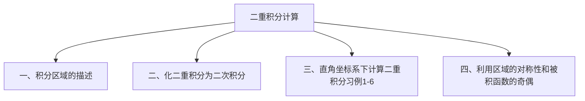

## 7.1 重积分

7.1.2 二重积分的计算

直角坐标系下重积分的计算

---

## 一、积分区域的描述

在直角坐标系下用平行于坐标轴的直线网来划分区域 $D$ ，如图。

可见，除边缘外，其余均为矩形，其面积为

$$
\Delta \sigma=\Delta x \Delta y
$$

则面积元素为 $d \sigma=d x d y$故二重积分可写为

$$
\iint_{D} f(x, y) d \sigma=\iint_{D} f(x, y) d x d y
$$

其中 $\boldsymbol{d} \boldsymbol{x} \boldsymbol{d} \boldsymbol{y}$ 称为面积元素．

特点：穿过 $D$ 的内部且平行于 $y$ 轴的直线与 $D$ 的边界的交点不多于两个，其不等式组的表示如下
$D_{x}:\left\{\begin{array}{l}\varphi_{1}(x) \leq y \leq \varphi_{2}(x) \\ a \leq x \leq b\end{array}\right.$
则称此积分区域是 $x$ 型区域。

---

## 利用二重积分的几何意义化二重积分为二次积分

根据二重积分的几何意义：若 $f(x, y) \geq 0$ ，则二重积分是以 $z=f(x, y)$ 为顶的曲顶柱体的体积。
故可以考虑用定积分应用中求平行截面面积为已知的立体的体积的方法。

平行截面面积已知的立体的体积

---

## （1）当积分区域如图所示

相应的曲顶柱体如右图。
在区间 $[a, b]$ 内任取一点 $x$ ，过此点作与 $y o z$面平行的平面，它与曲顶柱体相交得到一个一个曲边梯形：

在区间 $[a, b]$ 内任取一点 x ，过此点作与 $y \mathrm{oz}$面平行的平面，它与曲顶柱体相交得到一个一个曲边梯形：

> 底为 $\varphi_{1}(x) \leq y \leq \varphi_{2}(x)$
> 高为 $z=f(x, y)$

注意D的特殊之处。

$$
\mathrm{Z} \quad z=f(x, y)
$$

$$
A(x)=\int_{\varphi_{1}(x)}^{\varphi_{2}(x)} f(x, y) d y
$$

y
所以：

$$
\begin{gathered}
\iint_{D} f(x, y) d x d y=\int_{a}^{b} A(x) d x=\int_{a}^{b}\left[\int_{\varphi_{1}(x)}^{\varphi_{2}(x)} f(x, y) d y\right] d x \\
\quad \text { •二重积分 } \quad \rightarrow \text { •二次定积分 }
\end{gathered}
$$

$$
\begin{aligned}
& \therefore A(x)=\int_{\varphi_{1}(x)}^{\varphi_{2}(x)} f(x, y) d y \\
& \therefore \iint_{D} f(x, y) d \sigma=\int_{a}^{b}\left[\int_{\varphi_{1}(x)}^{\varphi_{2}(x)} f(x, y) d y\right] d x
\end{aligned}
$$

---

## 注意：

（1）先对 $y$ 后对 $x$ 的二次积分，计算时先把 $x$ 看作常数，对 $y$ 积分得到关于 $x$ 的函数，再对 $x$ 在 $[a, b]$ 上积分，记为

$$
\iint_{D} f(x, y) d \sigma=\int_{a}^{b} d x \int_{\varphi_{1}(x)}^{\varphi_{2}(x)} f(x, y) d y
$$

（2）$f(x, y)<0$ 时公式仍成立。

利用X一型区域 D 的不等式组表示，

$$
D_{x \text {-型 }}=\left\{\begin{array}{c}
a \leq x \leq b \\
\varphi_{1}(x) \leq y \leq \varphi_{2}(x)
\end{array},\right.
$$

有助于记住前面推出的二重积分计算公式：

$$
\iint_{D} f(x, y) d x d y=\int_{a}^{b}\left[\int_{\varphi_{1}(x)}^{\varphi_{2}(x)} f(x, y) d y\right] d x=\int_{a}^{b} d x \int_{\varphi_{1}(x)}^{\varphi_{2}(x)} f(x, y) d y
$$

（3）类似地，若积分区域为

$$
D_{y}\left\{\begin{array}{c}
c \leq y \leq d \\
\psi_{1}(y) \leq x \leq \psi_{2}(y)
\end{array},\right.
$$

则可将二重积分化为先积 $x$ 后积 $y$ 的二次积分：

特点：穿过 $D$ 的内部且平行于 $x$ 轴的直线与 $D$的边界的交点不多于两个，则称此积分区域是 $y$ 型区域。

$$
\iint_{D} f(x, y) d \sigma=\int_{c}^{d} d y \int_{\psi_{1}(y)}^{\psi_{2}(y)} f(x, y) d x
$$

（4）若 $D$ 既可表为 $x$ —型区域，又可表为 $y$ —型区域时，则

$$
\iint_{D} f(x, y) d \sigma=\int_{a}^{b} d x \int_{\varphi_{1}(x)}^{\varphi_{2}(x)} f(x, y) d y=\int_{c}^{d} d y \int_{\psi_{1}(y)}^{\psi_{2}(y)} f(x, y) d x
$$

（5）若 $D$ 既不是 $x$ —型区域又不是 $y$ —型区域时，则把 $D$ 分块得到一些 $x$ —型区域和 $y$ —型区域。
（1）画区域图；
（2）列出 $\boldsymbol{x}$ 型或 $\boldsymbol{y}$ 型区域的不等式组表示；
（3）计算二次积分
（若一种次序积不出来时，换另一种次序）。

---

## 三、直角坐标系下计算二重积分习例

例1 计算 $\iint x y d \sigma, D$ 由直线 $y=1, x=2$ 及 $y=x$ 围成。例2 计算 $\iint_{D}^{D} x y d \sigma, D$ 由 $y^{2}=x$ 和 $y=x-2$ 围成。
例3 计算 $I=\iint_{D} x^{2} e^{-y^{2}} d \sigma, D$ 由 $x=0, y=1, y=x$ 围成。
例4 计算 $\iint_{D} \frac{\sin x}{x} d x d y, D$ 由直线 $y=x, y=0, x=\pi$ 围成。
例5 改变积分 $\int_{0}^{1} d y \int_{0}^{2 y} f(x, y) d x+\int_{1}^{3} d y \int_{0}^{3-y} f(x, y) d x$ 的积分次序。
例 6 设 $f(x)$ 在 $[0,1]$ 上连续，且 $\int_{0}^{1} f(x) d x=A$ ，求 $\int_{0}^{1} d x \int_{x}^{1} f(x) f(y) d y$ ．

例1 计算 $\iint_{D} x y d \sigma, D$ 由直线 $y=1, x=2$ 及 $y=x$ 围成。
解（1）画区域图
（2）列出区域的不等式表示
$\boldsymbol{x}$ —型： $1 \leq \boldsymbol{y} \leq \boldsymbol{x}, 1 \leq \boldsymbol{x} \leq \mathbf{2}$
$\boldsymbol{y}$－型：$y \leq \boldsymbol{x} \leq \mathbf{2}, \mathbf{1} \leq \boldsymbol{y} \leq \mathbf{2}$
（3）将二重积分表示成二次积分并计算
$\iint_{D} x y d \sigma=\int_{1}^{2} d x \int_{1}^{x} x y d y=\left.\int_{1}^{2} x \frac{y^{2}}{2}\right|_{1} ^{x} d x=\int_{1}^{2} \frac{x}{2}\left(x^{2}-1\right) d x=\frac{9}{8}$ ．
或者 $\iint_{C} x y d \sigma=\int_{1}^{2} d y \int_{y}^{2} x y d x=\left.\int_{1}^{2} y \frac{x^{2}}{2}\right|_{y} ^{2} d y=\frac{9}{8}$ ．

例2 计算 $\iint_{D} x y d \sigma, D$ 由 $y^{2}=x$ 和 $y=x-2$ 围成。
解（1）画区域图
（2）列出区域的不等式表示 $\boldsymbol{x}$ —型： $\boldsymbol{D}_{1}:-\sqrt{\boldsymbol{x}} \leq \boldsymbol{y} \leq \sqrt{\boldsymbol{x}}, \mathbf{0} \leq \boldsymbol{x} \leq \mathbf{1}$

$$
D_{2}: x-2 \leq y \leq \sqrt{x}, 1 \leq x \leq 4
$$

$y$－型：$y^{2} \leq x \leq y+2,-1 \leq y \leq 2$
（3）列出二次积分并计算

$$
\begin{aligned}
& \iint_{D} x y d \sigma=\iint_{D_{1}} x y d \sigma+\iint_{D_{2}} x y d \sigma=\int_{0}^{1} d x \int_{-\sqrt{x}}^{\sqrt{x}} x y d y+\int_{1}^{4} d x \int_{x-2}^{\sqrt{x}} x y d y \\
& \quad \iint_{D} x y d \sigma=\int_{-1}^{2} d y \int_{y^{2}}^{y+2} x y d x=\frac{45}{8}
\end{aligned}
$$

例3 计算 $I=\iint_{D} x^{2} e^{-y^{2}} d \sigma, D$ 由 $x=0, y=1, y=x$ 围成。
解 $x$－型：$x \leq y \leq 1,0 \leq x \leq 1$
$y$－型： $0 \leq x \leq y, 0 \leq y \leq 1$

$$
\therefore I=\int_{0}^{1} d x \int_{x}^{1} x^{2} e^{-y^{2}} d y
$$

$=\int_{0}^{1} x^{2} d x \int_{x}^{1} e^{-y^{2}} d y$ 积不出来，须换另一种积分次序

$$
\begin{aligned}
\therefore I & =\int_{0}^{1} d y \int_{0}^{y} x^{2} e^{-y^{2}} d x=\left.\int_{0}^{1} e^{-y^{2}} \frac{x^{3}}{3}\right|_{0} ^{y} d y \\
& =\int_{0}^{1} \frac{1}{3} y^{3} e^{-y^{2}} d y=\frac{1}{6}-\frac{1}{3 e}
\end{aligned}
$$

例4 计算 $\iint_{D} \frac{\sin x}{x} d x d y, D$ 由直线 $y=x, y=0, x=\pi$ 围成。
解 由被积函数可知，先对 $\boldsymbol{x}$ 积分不行，因此取 $D$ 为 $X$ —型域：

$$
D:\left\{\begin{array}{l}
0 \leq x \leq \pi \\
0 \leq y \leq x
\end{array}\right.
$$

$$
\begin{array}{r}
\therefore \iint_{D} \frac{\sin x}{x} \mathrm{~d} x \mathrm{~d} y=\int_{0}^{\pi} \frac{\sin x}{x} \mathrm{~d} x \int_{0}^{x} \mathrm{~d} y \\
\quad=\int_{0}^{\pi} \sin x \mathrm{~d} x=[-\cos x]_{0}^{\pi}=2
\end{array}
$$

注意：$\frac{\sin x}{x}, \frac{1}{\ln x}, e^{x^{2}}, e^{\frac{1}{x}}$ 的原函数不能用初等函 数表示。

---

## 小结：利用直系计算二重积分的步骤

（1）画出积分区域的图形，求出边界曲线交点坐标；
（2）确定积分次序；
（3）确定积分限，化为二次定积分；
（4）计算两次定积分，即可得出结果。

注意：二重积分转化为二次定积分时，关键在于正确确定积分次序和积分上、下限，一定要做到熟练、准确。

怎样确定积分次序和积分上、下限？

---

## 问题 怎样确定积分次序和积分上、下限？

（I）根据积分域类型，确定积分次序和积分上、下限
（II）根据被积函数特点，确定积分限
确定积分次序和积分限要注意以下两个原则
（1）积分区域分块尽量少；
（2）被积函数易于积出。
要记住哦！

例5 改变积分 $\int_{0}^{1} d y \int_{0}^{2 y} f(x, y) d x+\int_{1}^{3} d y \int_{0}^{3-y} f(x, y) d x$ 的积分次序。

解 积分区域如图

$$
\begin{gathered}
0 \leq y \leq 1,0 \leq x \leq 2 y \\
1 \leq y \leq 3,0 \leq x \leq 3-y
\end{gathered}
$$

交换 积 分 次 序 $D:\left\{\begin{array}{c}0 \leq x \leq 2 \\ \frac{1}{2} x \leq y \leq 3-x, \mathrm{o}\end{array} \underset{2 \quad x}{x=2 y}\right.$

$$
\text { 原式 }=\int_{0}^{2} d x \int_{\frac{1}{2} x}^{3-x} f(x, y) d y \text {. }
$$

例 6．设 $f(x)$ 在 $[0,1]$ 上连续，且 $\int_{0}^{1} f(x) d x=A$ ，求 $\int_{0}^{1} d x \int_{x}^{1} f(x) f(y) d y$ 。
解 $\because \int_{x}^{1} f(y) d y$ 不能直接积出，故改变积分次序。

$$
\text { 令 } I=\int_{0}^{1} d x \int_{x}^{1} f(x) f(y) d y \text {, }
$$

则 $I=\int_{0}^{1} f(y) d y \int_{0}^{y} f(x) d x=\int_{0}^{1} f(x) d x \int_{0}^{x} f(y) d y$
故 $2 I=\int_{0}^{1} f(x) d x \int_{x}^{1} f(y) d y+\int_{0}^{1} f(x) d x \int_{0}^{x} f(y) d y$

$$
\begin{aligned}
& =\int_{0}^{1} f(x) d x\left[\left(\int_{0}^{x}+\int_{x}^{1}\right) f(y) d y\right] \\
& =\int_{0}^{1} f(x) d x \int_{0}^{1} f(y) d y=A^{2} . \therefore I=\frac{A^{2}}{2} .
\end{aligned}
$$

$1^{\circ}$ 交换二次积分次序的关键在于画出相应的积分区域图，即使题目简单也应将D域图画出。
$2^{\circ}$ 二次积分是连续作二次定积分，给出定积分时积分的下限未必一定要小于上限，而二重积分化为二次积分其下限一定不能大于上限，所以当给定的二次积分中出现下限大于上限时，应将上、下限颠倒过来，同时改变二次积分的符号。
$3^{0}$ 二次积分的外限一定是常数。

---

## 二、直角坐标系下二重积分计算的有关问题

1、给定如下简单的积分区域，怎样用不等式组的描述它们？

2．积分区域的不等式组描述的一般方法？
3、 直角坐标系下计算二重积分的关键步骤是什么？
4、如果积分区域 D 为：$a \leq x \leq b, c \leq y \leq d$ 时，则二重积分的计算公式简化为什么形式？
$\iint_{R} f(x, y) d A=\int_{c}^{d} d y \int_{a}^{b} \phi(x) \psi(y) d x=\left[\int_{a}^{b} \phi(x) d x\right] \cdot\left[\int_{c}^{d} \psi(y) d y\right]$

---

## 特殊情形

－如果 $f(x, y)$ 在矩形域上 $R=[a, b] \times[c, d]$ 上连续，则二重积分等于累次积分

如果 $f(x, y)=\varphi(x) \psi(y)$（两个单变量函数的乘积），则
$\iint_{R} f(x, y) d A=\int_{c}^{d} d y \int_{a}^{b} \phi(x) \psi(y) d x=\left[\int_{a}^{b} \phi(x) d x\right] \cdot\left[\int_{c}^{d} \psi(y) d y\right]$

补例 1：设 $f(x)$ 在区间 $[a, b]$ 上连续，且恒大于零，证明

$$
I=\int_{a}^{b} \frac{1}{f(x)} d x \int_{a}^{b} f(x) d x \geq(b-a)^{2}
$$

证明：由题设，I还可等于以下两种形式的积分

$$
\begin{aligned}
& I=\int_{a}^{b} \frac{1}{f(x)} d x \int_{a}^{b} f(y) d y, \text { 以及 } I=\int_{a}^{b} \frac{1}{f(y)} d y \int_{a}^{b} f(x) d x \\
& \therefore I=\frac{1}{2}\left(\int_{a}^{b} \frac{1}{f(x)} d x \int_{a}^{b} f(y) d y+\int_{a}^{b} \frac{1}{f(y)} d y \int_{a}^{b} f(x) d x\right) \\
& =\frac{1}{2} \iint_{D}\left(\frac{f(y)}{f(x)}+\frac{f(x)}{f(y)}\right) d x d y, \text { 其中 } D=\left\{\begin{array}{l}
a \leq x \leq b \\
a \leq y \leq b
\end{array}\right. \\
& \therefore I=\frac{1}{2} \iint_{D}\left(\frac{f(y)}{f(x)}+\frac{f(x)}{f(y)}\right) d x d y \geq \iint_{D} d x d y=(b-a)^{2}
\end{aligned}
$$

补例2：$f(x)$ 在 $[a, b]$ 上连续，试利用二重积分证明

$$
\left[\int_{a}^{b} f(x) d x\right]^{2} \leq(b-a) \int_{a}^{b} f^{2}(x) d x
$$

解：

$$
\begin{aligned}
{\left[\int_{a}^{b} f(x) d x\right]^{2} } & =\int_{a}^{b} f(x) d x \int_{a}^{b} f(y) d y \\
& =\iint_{D} f(x) f(y) d x d y \\
& \leq \frac{1}{2} \iint_{D}\left[f^{2}(x)+f^{2}(y)\right] d x d y \\
& =\iint_{D} f^{2}(x) d x d y \\
& =\int_{a}^{b} f^{2}(x) d x \int_{a}^{b} d y=(b-a) \int_{a}^{b} f^{2}(x) d x
\end{aligned}
$$

四、利用区域的对称性和被积函数的奇偶性以及轮换对称性简化二重积分

例7 计算 $\iiint_{|x|+y \mid \leq 1}|x y| d x d y$ ．例8 计算 $\iint_{\substack{-1 \leq x \leq 1 \\ 0 \leq y \leq 1}}\left|y-x^{2}\right| d x d y$ ．例9 求 $I=\iint_{D} \frac{f(x)}{f(x)+f(y)} d x d y,\left(f(x)>0, D: x^{2}+y^{2}<R^{2}\right)$ ．

例10 设 $f(x)$ 在区间 $[a, b]$ 上连续，且恒大于零，证明

$$
I=\int_{a}^{b} \frac{1}{f(x)} d x \int_{a}^{b} f(x) d x \geq(b-a)^{2}
$$

例11 设 $f(x)$ 在区间 $[a, b]$ 上连续，试利用二重积分证明

$$
\left[\int_{a}^{b} f(x) d x\right]^{2} \leq(b-a) \int_{a}^{b} f^{2}(x) d x .
$$

例7 计算 $\underset{\mid x+y \leq 1}{\iint_{y \leq}|x y| d x d y \text { ．}}$
解 由区域的对称性和函数的奇偶性可得

原式 $=4 \iint_{D} x y d x d y$
$=4 \int_{0}^{1} d x \int_{0}^{1-x} x y d y$.

例8 计算 $\underset{\substack{-1 \leq x \leq 1 \\ 0 \leq y \leq 1}}{\iint\left|y-x^{2}\right| d x d y \text { ．}}$
解 原式 $=2 \iint_{D}\left|y-x^{2}\right| d x d y$

$$
\begin{aligned}
& =2 \iint_{D_{1}}\left|y-x^{2}\right| d x d y+2 \iint_{D_{2}}\left|y-x^{2}\right| d x d y \\
& =2 \iint_{D_{1}}\left(y-x^{2}\right) d x d y+2 \iint_{D_{2}}\left(x^{2}-y\right) d x d y \\
& =2 \int_{0}^{1} d x \int_{x^{2}}^{1}\left(y-x^{2}\right) d y+2 \int_{0}^{1} d x \int_{0}^{x^{2}}\left(x^{2}-y\right) d y
\end{aligned}
$$

例9 求 $I=\iint_{D} \frac{f(x)}{f(x)+f(y)} d x d y,\left(f(x)>0, D: x^{2}+y^{2}<R^{2}\right)$ ．解：$I=\iint_{D} \frac{f(x)}{f(x)+f(y)} d x d y$（轮换对称）

$$
\begin{aligned}
& =\frac{1}{2}\left[\iint_{D} \frac{f(x)}{f(x)+f(y)}+\iint_{D} \frac{f(x)}{f(x)+f(y)}\right] d x d y \\
& =\frac{1}{2}\left[\iint_{D} \frac{f(x)}{f(x)+f(y)}+\iint_{D} \frac{f(y)}{f(x)+f(y)}\right] d x d y \\
& =\frac{1}{2} \iint_{D} d x d y=\frac{1}{2} \pi R^{2}
\end{aligned}
$$

例10 设 $f(x)$ 在区间 $[a, b]$ 上连续，且恒大于零，证明

$$
I=\int_{a}^{b} \frac{1}{f(x)} d x \int_{a}^{b} f(x) d x \geq(b-a)^{2}
$$

证明：由题设，I还可等于以下两种形式的积分

$$
\begin{aligned}
& I=\int_{a}^{b} \frac{1}{f(x)} d x \int_{a}^{b} f(y) d y, \text { 以及 } I=\int_{a}^{b} \frac{1}{f(y)} d y \int_{a}^{b} f(x) d x \\
& \therefore I=\frac{1}{2}\left(\int_{a}^{b} \frac{1}{f(x)} d x \int_{a}^{b} f(y) d y+\int_{a}^{b} \frac{1}{f(y)} d y \int_{a}^{b} f(x) d x\right) \\
& =\frac{1}{2} \iint_{D}\left(\frac{f(y)}{f(x)}+\frac{f(x)}{f(y)}\right) d x d y, \text { 其中 } D=\left\{\begin{array}{l}
a \leq x \leq b \\
a \leq y \leq b
\end{array}\right. \\
& \therefore I=\frac{1}{2} \iint_{D}\left(\frac{f(y)}{f(x)}+\frac{f(x)}{f(y)}\right) d x d y \geq \iint_{D} d x d y=(b-a)^{2}
\end{aligned}
$$

例11 设 $f(x)$ 在区间 $[a, b]$ 上连续，试利用二重积分证明

$$
\left[\int_{a}^{b} f(x) d x\right]^{2} \leq(b-a) \int_{a}^{b} f^{2}(x) d x .
$$

解 $\left[\int_{a}^{b} f(x) d x\right]^{2}=\int_{a}^{b} f(x) d x \int_{a}^{b} f(y) d y$

$$
\begin{aligned}
& =\iint_{D} f(x) f(y) d x d y \\
\leq & \frac{1}{2} \iint_{D}\left[f^{2}(x)+f^{2}(y)\right] d x d y \\
= & \iint_{D} f^{2}(x) d x d y \\
= & \int_{a}^{b} f^{2}(x) d x \int_{a}^{b} d y=(b-a) \int_{a}^{b} f^{2}(x) d x
\end{aligned}
$$

（1）$x^{2}+y^{2}=6-z, x=0, y=0, z=0, x+y=1$
（2）$x=2 y, \frac{x}{4}+\frac{y}{2}+\frac{z}{2}=1, z=0$
解：

$$
\begin{aligned}
V_{1} & =\iint_{D}\left(6-x^{2}-y^{2}\right) d x d y \\
& =\int_{0}^{1} d x \int_{0}^{1-x}\left(6-x^{2}-y^{2}\right) d y \\
& =\int_{0}^{1}\left[\left(6-x^{2}\right)(1-x)-\frac{1}{3}(1-x)^{3}\right] d x \\
& =\frac{17}{6}
\end{aligned}
$$

(2) $x=2 y^{2}, \frac{x}{4}+\frac{y}{2}+\frac{z}{2}=1, z=0$

解: $V_{2}=\iint_{D} 2\left(1-\frac{x}{4}-\frac{y}{2}\right) d x d y$

$$
\begin{aligned}
& =\int_{-2}^{1} d y \int_{2 y^{2}}^{4-2 y}\left(2-\frac{x}{2}-y\right) d x \\
& =\frac{81}{10}
\end{aligned}
$$

---

## 3.2 二重积分计算（1）

一、单项选择题：
1．$I=\int_{0}^{1} d x \int_{x^{2}}^{x} f(x, y) d y$ ，更换积分次序后得 $I=(\quad)$
（A） $\int_{x^{2}}^{x} d y \int_{0}^{1} f(x, y) d y$
（B） $\int_{0}^{1} d y \int_{y}^{\sqrt{y}} f(x, y) d x$
（C） $\int_{0}^{1} d y \int_{y^{2}}^{y} f(x, y) d x$
（D） $\int_{y}^{\sqrt{y}} d y \int_{0}^{1} f(x, y) d x$

2．设 $D=\left\{(x, y)| | x|\leq 1,|y| \leq 2\}\right.$ ，则 $\iint_{D}\left(x^{2}+x y^{2}\right) d x d y=$
（A）$\frac{2}{3}$
（B）$\frac{4}{3}$
（C）$\frac{6}{3}$
（D）$\frac{8}{3}$

3．设 $f(x, y)$ 连续，且 $f(x, y)=x y+\iint_{D} f(u, v) d u d v$ ，其中 $D$ 是由 $y=0, y=x^{2}$ ， $x=1$ 所围成区域，则 $f(x, y)$ 等于（ ）
（A）$x y$ ；
（B） $2 x y$ ；
（C）$x y+\frac{1}{8}$ ；
（D）$x y+1$ ．

二、填空题：
1． $\iint_{|x|+|y| \leqslant 1}\left(x^{2}+y\right) d x d y=$

2．更换积分次序计算二次积分 $\int_{0}^{1} d x \int_{x}^{1} e^{-y^{2}} d y=$ ．

3．更换积分次序计算二次积分 $\int_{0}^{1} d x \int_{x}^{\sqrt{x}} \frac{\sin y}{y} d y=$ $\_\_\_\_$
解：

$$
\int_{0}^{1} d x \int_{x}^{\sqrt{x}} \frac{\sin y}{y} d y
$$

---

## 三、计算题

1． $\iint_{D}\left(x^{2}+y^{2}-x\right) d x d y$ ，其中 $D$ 是由直线 $y=2, y=x$ 及 $y=2 x$ 所围成的闭区域。
（1）画出积分区域，并积分将区域分别用不等式表示为 $X$－型区域以及 $Y$－型区域的形式。
（2）求其积分值
s

2． $\iint_{D}\left(y^{2}-x\right) d \sigma, D$ 由曲线 $x=y^{2}$ 与 $x=3-2 y^{2}$ 所围成；

法二：$D$ 关于 $x$ 轴对称，函数 $f(x, y)=y^{2}-x=f(x,-y)$ 即关于 $y$ 是偶函数。

$$
\begin{aligned}
& \text { 故 } \iint_{D}\left(y^{2}-x\right) d \sigma=2 \iint_{D}\left(y^{2}-x\right) d \sigma, \text { 其中 } D_{1}:\left\{\begin{array}{l}
0 \leq y \leq 1 \\
y^{2} \leq x \leq 3-2 y^{2}
\end{array}\right. \\
& \begin{aligned}
\iint_{D}\left(y^{2}-x\right) d \sigma & =\int_{0}^{1} d y \int_{y^{2}}^{3-2 y}\left(y^{2}-x\right) d x=\left.\int_{0}^{1}\left(y^{2} x-\frac{1}{2} x^{2}\right)\right|_{y^{2}} ^{3-2 y^{2}} d y \\
& =\left.\int_{0}^{1}\left(y^{2} x-\frac{1}{2} x^{2}\right)\right|_{y^{2}} ^{3-2 y^{2}} d y=\int_{0}^{1}\left(-\frac{9}{2} y^{4}+9 y^{2}-\frac{9}{2}\right) d y \\
& =\left.\left(-\frac{9}{10} y^{5}+3 y^{3}-\frac{9}{2} y\right)\right|_{0} ^{1}=-\frac{24}{10}
\end{aligned} \\
& \iint_{D}\left(y^{2}-x\right) d \sigma
\end{aligned}
$$

3．计算 $\iint_{D} \max \{x, y\} d x d y$ ，其中 $D: 0 \leq x \leq 3,0 \leq y \leq 1$ ．

4．求 由 平面 $x=0, y=0, x+y=1$ 所围成的柱体被平面 $z=0$ 及抛物面 $x^{2}+y^{2}=6-z$ 截得的立体的体积。

---

## 7.1.2 二重积分的计算（2）

当一些二重积分的积分区域 $\mathbf{D}$ 用直角坐标表示比较复杂（如圆形域），或者一些函数它们的二重积分在直角坐标系下根本无法计算时，比如：

$$
\iint_{D: 1 \leq x^{2}+y^{2} \leq 4} e^{x^{2}+y^{2}} d \sigma
$$

问题 怎样计算此类积分？

在极坐标系下，$f(x, y)$

$$
=f(r \cos \theta, r \sin \theta)
$$

$$
e^{x^{2}+y^{2}} \Rightarrow e^{r^{2}}
$$

$$
\begin{aligned}
& D: 1 \leq x^{2}+y^{2} \leq 4 \\
& \Rightarrow D^{\prime}:\left\{\begin{array}{l}
0 \leq \theta \leq \frac{\pi}{2} \\
1 \leq r \leq 2
\end{array}\right.
\end{aligned}
$$

将直角坐标系下的 $\iint_{D} f(x, y) d x d y$
化为在极坐标系下的二重积分是什么形式？
其中，$f(x, y)$ 可化为 $f(r \cos \theta, r \sin \theta)$ ，则 $\iint_{D} d x d y \rightarrow$ ？
即 $d \sigma=$ ？（在极坐标系下）
且积分次序是怎样的形式？

将直系下的二重积分化为极系后，极系下的二重积分仍然需要化为二次积分来计算。

关键是定出 $r, \theta$ 的上下限

---

## 一、极坐标系下化二重积分为二次积分

$$
\because \iint_{D} f(x, y) d \sigma=\lim _{\lambda \rightarrow 0} \sum_{i=1}^{n} f\left(\xi_{i}, \eta_{i}\right) \Delta \sigma_{i}
$$

用一族同心圆和一族射线形成的网把区域 $D$ 分块（如图）此时

$$
\begin{aligned}
& \Delta \sigma_{i}=\frac{1}{2}\left(r_{i}+\Delta r_{i}\right)^{2} \Delta \theta_{i}-\frac{1}{2} r_{i}^{2} \Delta \\
& =\frac{\left(r_{i}+\Delta r_{i}\right)+r_{i}}{2} \Delta r_{i} \Delta \theta_{i}=\bar{r}_{i} \Delta r_{i} \Delta \theta_{i}
\end{aligned}
$$

取圆周上一点 $\left(\bar{r}_{i}, \bar{\theta}_{i}\right)$ 相对应的直角坐标为 $\left(\xi_{i}, \eta_{i}\right)$ ，则 $\xi_{i}=\bar{r}_{i} \cos \overline{\theta_{i}}, \eta_{i}=\overline{r_{i}} \sin \overline{\theta_{i}}$

故 $\lim _{\lambda \rightarrow 0} \sum_{i=1}^{n} f\left(\xi_{i}, \eta_{i}\right) \Delta \sigma_{i}=\lim _{\lambda \rightarrow 0} \sum_{i=1}^{n} f\left(\overline{r_{i}} \cos \overline{\theta_{i}}, \overline{r_{i}} \sin \overline{\theta_{i}}\right) \overline{r_{i}} \Delta r_{i} \Delta \theta_{i}$
即 $\iint_{D} f(x, y) d \sigma=\iint_{D} f(r \cos \theta, r \sin \theta) r d r d \theta$
极坐标下的二重积分可用二次积分来计算
关键是定出 $r, \theta$ 的上下限
在极坐标系下积分区域D的面积

$$
\sigma=\iint_{D} r d r d \theta .
$$

说明：在极坐标下计算二重积分，一般分以下三个步骤：
（1）作出积分区域 $D$ 的平面图形；
（2）从极点出发作一条射线穿过 $D$ ，并按逆时针方向扫过整个区域，从而确定积分变量 $r$ 和 $\theta$ 的范围；
$D=\left\{\begin{array}{c}\alpha \leq \theta \leq \beta \\ r_{1}(\theta) \leq r \leq r_{2}(\theta)\end{array}\right.$
（3）$I=\int_{\alpha}^{\beta} d \theta \int_{r_{1}(\theta)}^{r_{2}(\theta)} f(r \cos \theta, r \sin \theta) r d r$

---

## 要点与步骤：

（1）用直角坐标系计算繁锁或不能计算的可以用极坐标计算；
（2）极坐标适用于圆，圆环，扇形区域以及被积函数含有 $x^{2}+y^{2}$ 等；
（3）画区域图，列出 $\theta$ 型区域，写成极坐标下的二次积分．

---

## 二、极坐标系下积分区域的表示

（1）若 $D: \varphi_{1}(\theta) \leq r \leq \varphi_{2}(\theta), \alpha \leq \theta \leq \beta$ ，则

$$
\iint_{D} f(r \cos \theta, r \sin \theta) r d r d \theta=\int_{\alpha}^{\beta} d \theta \int_{\varphi_{1}(\theta)}^{\varphi_{2}(\theta)} f(r \cos \theta, r \sin \theta) r d r
$$

（2）若 $D: 0 \leq r \leq \varphi(\theta), \alpha \leq \theta \leq \beta$ ，则

$$
\begin{aligned}
& \iint_{D} f(r \cos \theta, r \sin \theta) r d r d \theta \\
& =\int_{\alpha}^{\beta} d \theta \int_{0}^{\varphi(\theta)} f(r \cos \theta, r \sin \theta) r d r
\end{aligned}
$$

（3）此时 $D: 0 \leq r \leq \varphi(\theta), 0 \leq \theta \leq 2 \pi$ ，且

$$
\begin{aligned}
& \iint_{D} f(r \cos \theta, r \sin \theta) r d r d \theta \\
& =\int_{0}^{2 \pi} d \theta \int_{0}^{\varphi(\theta)} f(r \cos \theta, r \sin \theta) r d r
\end{aligned}
$$

（4）此时 $D: \varphi_{1}(\theta) \leq r \leq \varphi_{2}(\theta), 0 \leq \theta \leq 2 \pi$ ，且

1．写出下列常见曲线的极坐标方程：

$$
y=x ; \quad x^{2}+y^{2}=9 ; \quad x^{2}+y^{2}=6 x ; \quad x^{2}+y^{2}=6 y
$$

2．比较圆形域 D：$x^{2}+y^{2} \leq 9$ 下的二重积分 $\iint_{D} f(x, y) d \sigma$ ，分别在直角坐标系下和极坐标系下对区域 D 的不等式组表示，哪种较简便？

3．写出极坐标系下积分区域的不等式组表示
（1）$a^{2} \leq x^{2}+y^{2} \leq b^{2}$ ，且 $x \geq 0, y \geq 0(a>0, b>0)$ 。
（2）$x^{2}+y^{2} \leq 2 a x, x^{2}+y^{2} \leq 2 a y$
（3）$D=\left\{(x, y) \mid 1-x \leq y \leq \sqrt{1-x^{2}}, 0 \leq x \leq 1\right\}$

---

## 三、极坐标系下计算二重积分习例

例 1 计算 $\iint_{D} e^{-x^{2}-y^{2}} d x d y$ ，其中 $D$ 是由中心在原点，半径为 $a$ 的圆周所围成的闭区域。

例 2 写出积分 $\iint_{D} f(x, y) d x d y$ 的极坐标二次积分形式，其中积分区域 $D=\left\{(x, y) \mid 1-x \leq y \leq \sqrt{1-x^{2}}, 0 \leq x \leq 1\right\}$ ．

例3 计算 $\iint_{D}\left(x^{2}+y^{2}\right) d x d y$ ，其 $D$ 为由圆 $x^{2}+y^{2}=2 y, x^{2}+y^{2}=4 y$ 及直线 $x-\sqrt{3} y=0$, $y-\sqrt{3} x=0$ 所围成的平面闭区域。

例 4 计算二重积分 $\iint_{D} \frac{\sin \left(\pi \sqrt{x^{2}+y^{2}}\right)}{\sqrt{x^{2}+y^{2}}} d x d y$ ，其中积分区域为 $D=\left\{(x, y) \mid 1 \leq x^{2}+y^{2} \leq 4\right\}$ ．

例5 交换积分次序，且化为极坐标下的二次积分

$$
\int_{0}^{2 a} d x \int_{0}^{\sqrt{2 a x-x^{2}}} f\left(\frac{y}{x}\right) d y
$$

例6 计算 $\iint_{D} x^{2}+y^{2}-4 d x d y$ ，其中 $D: x^{2}+y^{2} \leq 16$ ．
例7 求球体 $x^{2}+y^{2}+z^{2} \leq 4 a^{2}$ 被圆柱面 $x^{2}+y^{2}=2 a x (a>0)$ 所截得的（含在柱面内的）立体的体积。

例 1 计算 $\iint_{D} e^{-x^{2}-y^{2}} d x d y$ ，其中 $D$ 是由中心在原点，半径为 $a$ 的圆周所围成的闭区域．

解 在极坐标系下
$\mathrm{D}: 0 \leq r \leq a, 0 \leq \theta \leq 2 \pi$ ．

$$
\iint_{D} e^{-x^{2}-y^{2}} d x d y=\int_{0}^{2 \pi} d \theta \int_{0}^{a} e^{-r^{2}} r d r=\pi\left(1-e^{-a^{2}}\right)
$$

由于 $e^{-x^{2}}$ 的原函数不是初等函数，故本题无法用直角坐标计算。

例 2 写出积分 $\iint_{D} f(x, y) d x d y$ 的极坐标二次积分形式，其中积分区域 $D=\left\{(x, y) \mid 1-x \leq y \leq \sqrt{1-x^{2}}, 0 \leq x \leq 1\right\}$ ．
解 在极坐标系下 $\left\{\begin{array}{l}x=r \cos \theta \\ y=r \sin \theta\end{array}\right.$
所以圆方程为 $r=1$ ，
直线方程为 $r=\frac{1}{\sin \theta+\cos \theta}$ ，
$D:\left\{\begin{array}{c}0 \leq \theta \leq \frac{\pi}{2}, \\ \frac{1}{\sin \theta+\cos \theta} \leq r \leq 1,\end{array}\right.$
$\iint_{D} f(x, y) d x d y=\int_{0}^{\frac{\pi}{2}} d \theta \int_{\frac{1}{\sin \theta+\cos \theta}}^{1} f(r \cos \theta, r \sin \theta) r d r$.

例3 计算 $\iint_{D}\left(x^{2}+y^{2}\right) d x d y$ ，其 $D$ 为由圆 $x^{2}+y^{2}=2 y, x^{2}+y^{2}=4 y$ 及直线 $x-\sqrt{3} y=0$, $y-\sqrt{3} x=0$ 所围成的平面闭区域。

解

$$
\begin{aligned}
& y-\sqrt{3} x=0 \Rightarrow \theta_{2}=\frac{\pi}{3} \\
& x^{2}+y^{2}=4 y \Rightarrow r=4 \sin \theta \\
& x-\sqrt{3} y=0 \Rightarrow \theta_{1}=\frac{\pi}{6} \\
& x^{2}+y^{2}=2 y \Rightarrow r=2 \sin \theta
\end{aligned}
$$

$$
D=\left\{\begin{array}{c}
\frac{\pi}{6} \leq \theta \leq \frac{\pi}{3} \\
2 \sin \theta \leq r \leq 4 \sin \theta
\end{array}\right.
$$

$$
\begin{aligned}
\iint_{D}\left(x^{2}+y^{2}\right) d x d y & =\iint_{D} r^{2} \cdot r d r d \theta \\
& =\int_{\frac{\pi}{6}}^{\frac{\pi}{3}} d \theta \int_{2 \sin \theta}^{4 \sin \theta} r^{2} \cdot r d r=15\left(\frac{\pi}{2}-\sqrt{3}\right)
\end{aligned}
$$

例 4 计算二重积分 $\iint_{D} \frac{\sin \left(\pi \sqrt{x^{2}+y^{2}}\right)}{\sqrt{x^{2}+y^{2}}} d x d y$ ，其中积分区域为 $D=\left\{(x, y) \mid 1 \leq x^{2}+y^{2} \leq 4\right\}$ ．

解 由对称性，可只考虑第一象限部分，

$$
D=4 D_{1}
$$

注意：被积函数也要有对称性．

$$
D_{1}=\left\{\begin{array}{l}
0 \leq \theta \leq \frac{\pi}{2} \\
1 \leq r \leq 2
\end{array}\right.
$$

$$
\begin{gathered}
D_{1}=\left\{\begin{array}{l}
0 \leq \theta \leq \frac{\pi}{2} \\
1 \leq r \leq 2
\end{array}\right. \\
\iint_{D} \frac{\sin \left(\pi \sqrt{x^{2}+y^{2}}\right)}{\sqrt{x^{2}+y^{2}}} d x d y=4 \iint_{D_{1}} \frac{\sin \left(\pi \sqrt{x^{2}+y^{2}}\right)}{\sqrt{x^{2}+y^{2}}} d x d y \\
=4 \iint_{D_{1}} \frac{\sin (\pi r)}{r} r d r d \theta=4 \int_{0}^{\frac{\pi}{2}} d \theta \int_{1}^{2} \sin \pi r d r=-4 .
\end{gathered}
$$

例5 交换积分次序，且化为极坐标下的二次积分

$$
\int_{0}^{2 a} d x \int_{0}^{\sqrt{2 a x-x^{2}}} f\left(\frac{y}{x}\right) d y .
$$

解 $\because D: 0 \leq y \leq \sqrt{2 a x-x^{2}, 0} \leq x \leq 2 a$
y型区域：$a-\sqrt{a^{2}-y^{2}} \leq x \leq a+\sqrt{a^{2}-y^{2}}, 0 \leq y \leq a$
$\theta$ 型区域： $0 \leq r \leq 2 a \cos \theta, 0 \leq \theta \leq \frac{\pi}{2}$
∴ 原式 $=\int_{0}^{\frac{\pi}{2}} d \theta \int_{0}^{2 a \cos \theta} f(\tan \theta) r d r$.

例6 计算 $\iint_{D} x^{2}+y^{2}-4 d x d y$ ，其中 $D: x^{2}+y^{2} \leq 16$ ．
解 令 $x^{2}+y^{2}-4=0$ ，得空间曲面与 $x o y$ 面的交线，
可去掉绝对值符号，如图

$$
\begin{aligned}
& \iint_{x^{2}+y^{2} \leq 16}\left|x^{2}+y^{2}-4\right| d x d y \\
= & \iint_{D_{1}}\left(4-x^{2}-y^{2}\right) d x d y+\iint_{D_{3}}\left(x^{2}+y^{2}-4\right) d x d y \\
= & 4 \int_{0}^{\frac{\pi}{2}} d \theta \int_{0}^{2}\left(4-r^{2}\right) r d r+4 \int_{0}^{\frac{\pi}{2}} d \theta \int_{2}^{4}\left(r^{2}-4\right) r d r \\
= & 80 \pi
\end{aligned}
$$

例7 求球体 $x^{2}+y^{2}+z^{2} \leq 4 a^{2}$ 被圆柱面 $x^{2}+y^{2}=2 a x (a>0)$ 所截得的（含在柱面内的）立体的体积。

解 设 $D: 0 \leq r \leq 2 a \cos \theta, 0 \leq \theta \leq \frac{\pi}{2}$由对称性可知

$$
\begin{aligned}
V & =4 \iint_{D} \sqrt{4 a^{2}-r^{2}} r \mathrm{~d} r \mathrm{~d} \theta \\
& =4 \int_{0}^{\pi / 2} \mathrm{~d} \theta \int_{0}^{2 a \cos \theta} \sqrt{4 a^{2}-r^{2}} r \mathrm{~d} r \\
& =\frac{32}{3} a^{3} \int_{0}^{\pi / 2}\left(1-\sin ^{3} \theta\right) \mathrm{d} \theta=\frac{32}{3} a^{3}\left(\frac{\pi}{2}-\frac{2}{3}\right)
\end{aligned}
$$

---

## 四、概率积分公式推导

－概率积分公式 概率论与数理统计及工程上非常有用的反常积分公式

$$
\int_{0}^{+\infty} e^{-x^{2}} \mathrm{~d} x=\frac{\sqrt{\pi}}{2}
$$

解

$$
\begin{aligned}
& I=\left(\int_{0}^{+\infty} e^{-x^{2}} d x\right)^{2}=\lim _{R \rightarrow+\infty}\left(\int_{0}^{R} e^{-x^{2}} d x\right)^{2} \\
& =\lim _{R \rightarrow+\infty}\left(\int_{0}^{R} e^{-x^{2}} d x \int_{0}^{R} e^{-y^{2}} d y\right) \\
& =\lim _{R \rightarrow+\infty} \iint_{S=[0, R] \times[0, R]} e^{-\left(x^{2}+y^{2}\right)} d \sigma
\end{aligned}
$$

$$
\begin{aligned}
& D_{1}=\left\{(x, y) \mid x^{2}+y^{2} \leq R^{2}\right\} \\
& D_{2}=\left\{(x, y) \mid x^{2}+y^{2} \leq 2 R^{2}\right\}
\end{aligned}
$$

这里 $D_{1} \subset S \subset D_{2}$

$$
\because e^{-x^{2}-y^{2}}>0,
$$

$$
\therefore \iint_{D_{1}} e^{-x^{2}-y^{2}} d x d y \leq \iint_{S} e^{-x^{2}-y^{2}} d x d y \leq \iint_{D_{2}} e^{-x^{2}-y^{2}} d x d y .
$$

$$
\begin{aligned}
& I_{1}=\iint_{D_{1}} e^{-x^{2}-y^{2}} d x d y \\
&=\int_{0}^{\frac{\pi}{2}} d \theta \int_{0}^{R} e^{-r^{2}} r d r=\frac{\pi}{4}\left(1-e^{-R^{2}}\right) ; \\
& I_{2}=\iint_{D_{2}} e^{-x^{2}-y^{2}} d x d y=\frac{\pi}{4}\left(1-e^{-2 R^{2}}\right) ; \\
& \because I_{1}<I<I_{2} \\
& \therefore \frac{\pi}{4}\left(1-e^{-R^{2}}\right)<\left(\int_{0}^{R} e^{-x^{2}} d x\right)^{2}<\frac{\pi}{4}\left(1-e^{-2 R^{2}}\right)
\end{aligned}
$$

$$
\begin{aligned}
& R \rightarrow \infty, \quad I_{1} \rightarrow \frac{\pi}{4}, \quad I_{2} \rightarrow \frac{\pi}{4}, \\
& R \rightarrow \infty, \quad I \rightarrow \frac{\pi}{4}, \quad\left(\int_{0}^{\infty} e^{-x^{2}} d x\right)^{2}=\frac{\pi}{4}, \\
& \int_{0}^{\infty} e^{-x^{2}} d x=\frac{\sqrt{\pi}}{2} . \\
& \text { 由 } \int_{0}^{+\infty} e^{-x^{2}} d x=\frac{\sqrt{\pi}}{2}, \text { 得 } \int_{-\infty}^{+\infty} e^{-x^{2}} d x=\sqrt{\pi} \\
& \text { 令 } t=\sqrt{2} x \Rightarrow \int_{-\infty}^{+\infty} e^{-x^{2} / 2} d x=\sqrt{2 \pi}
\end{aligned}
$$

---

## －特殊函数（分段）的二重积分

例题3.2.12 设 $\left.D=\{x, y\} \mid x^{2}+y^{2} \leq \sqrt{2}, x \geq 0, y \geq 0\right\},\left[1+x^{2}+y^{2}\right]$表示不超过的最大整数。计算 $\iint x y\left[1+x^{2}+y^{2}\right] d x d y$
解：$D_{1}=\left\{(x, y) \mid 0 \leq x^{2}+y^{2}<1, x \stackrel{D}{\geq} 0, y \geq 0\right\}$ ，
在 $D_{1}$ 内，$f(x, y)=x y\left[1+x^{2}+y^{2}\right]=x y$
$D_{2}=\left\{(x, y) \mid 1 \leq x^{2}+y^{2} \leq \sqrt{2}, x \geq 0, y \geq \overline{0\}}\right.$,在 $D_{2}$ 内，$f(x, y)=x y\left[1+x^{2}+y^{2}\right]=2 x y$

$$
\begin{aligned}
& I=\iint_{D_{1}} x y d x d y+2 \iint_{D_{2}} x y d x d y \\
= & \int_{0}^{\frac{\pi}{2}} d \theta \int_{0}^{1} r \cos \theta r \sin \theta r d r+2 \int_{0}^{\frac{\pi}{2}} d \theta \int_{1}^{2^{\frac{1}{4}}} r \cos \theta r \sin \theta r d r=\frac{3}{8}
\end{aligned}
$$

$$
\iint_{[0,1] \times[0,1]}\left|x^{2}+y^{2}-1\right| d \sigma
$$

解：$D_{1}=\left\{(x, y) \mid x^{2}+y^{2} \leq 1,(x, y) \in D\right\}$ ，在 $D_{1}$ 内，$f(x, y)=1-x^{2}-y^{2}$

$$
\begin{gathered}
D_{2}=\left\{(x, y) \mid x^{2}+y^{2}>1,(x, y) \in D\right\}, \\
D_{2} \text { 内, } f(x, y)=x^{2}+y^{2}-1 \\
I=\iint_{D_{1}}\left(1-r^{2}\right) r d r d \theta+\iint_{D_{2}}\left(x^{2}+y^{2}-1\right) d x d y \\
=\int_{0}^{\frac{\pi}{2}} d \theta \int_{0}^{1}\left(1-r^{2}\right) r d r+\iint_{[0,1] \times[0,1]}\left(x^{2}+y^{2}-1\right) d x d y-\iint_{D_{1} \cdot x^{2}+y^{2} \leq 1}\left(x^{2}+y^{2}-1\right) d x d y \\
=\frac{\pi}{8} \times 2+\int_{0}^{1} d x \int_{0}^{1}\left(x^{2}+y^{2}-1\right) d y=\frac{\pi}{4}-\frac{1}{3}
\end{gathered}
$$

P181－14（6）计算 $\iint_{D}\left|x^{2}+y^{2}-4\right| d x d y$ ．其中 $D: x^{2}+y^{2} \leq 16$ ．
解：令 $x^{2}+y^{2}-4=0$ ，得空间曲面与 $x \mathrm{oy}$ 面的交线，可去掉绝对值符号，如图

$$
\begin{aligned}
& \iint_{x^{2}+y^{2} \leq 16}\left|x^{2}+y^{2}-4\right| d x d y \\
= & \iint_{D_{1}}\left(4-x^{2}-y^{2}\right) d x d y+\iint_{D_{3}}\left(x^{2}+y^{2}-4\right) d x d y \\
= & 4 \int_{0}^{\frac{\pi}{2}} d \theta \int_{0}^{2}\left(4-r^{2}\right) r d r+4 \int_{0}^{\frac{\pi}{2}} d \theta \int_{2}^{4}\left(r^{2}-4\right) r d r \\
= & 80 \pi
\end{aligned}
$$

$P 182-16$ 求由平面 $y=0, y=k x(k>0), z=0$ 以及球心在原点半径为 $R$ 的上半球面所围成的立体的体积。

解：$y=k x$ 的极坐标方程为 $\theta=\arctan k$

$$
\begin{aligned}
& V=\iint_{D} \sqrt{R^{2}-x^{2}-y^{2}} d x d y \\
& =\int_{0}^{\arctan k} d \theta \int_{0}^{R} \sqrt{R^{2}-r^{2}} r d r \\
& =\arctan \theta \cdot \frac{R^{3}}{3}
\end{aligned}
$$

P182－17计算以 $x o y$ 面上的圆周 $x^{2}+y^{2}=a x$ 围成的闭区域为底，而以曲面 $z=x^{2}+y^{2}$ 为顶的曲顶柱体的体积．

解：$\quad V=\iint_{D}\left(x^{2}+y^{2}\right) d x d y$

$$
\begin{aligned}
& =\int_{-\frac{\pi}{2}}^{\frac{\pi}{2}} d \theta \int_{0}^{a \cos \theta} r^{2} \cdot r d r \\
& =\frac{1}{4} a^{4} \int_{-\frac{\pi}{2}}^{\frac{\pi}{2}} \cos ^{4} \theta d \theta \\
& =\frac{1}{2} a^{4} \int_{0}^{\frac{\pi}{2}} \cos ^{4} \theta d \theta \\
& =\frac{1}{2} a^{4} \cdot \frac{3}{4 \cdot 2} \cdot \frac{\pi}{2}=\frac{3}{32} \pi a^{4}
\end{aligned} \quad D=\left\{\begin{array}{c}
-\frac{\pi}{2} \leq \theta \leq \frac{\pi}{2} \\
0 \leq r \leq a \cos \theta
\end{array}\right.
$$

---

## 一、单项选择题

1．设 $D$ 为 $0 \leq y \leq 1-x, 0 \leq x \leq 1$ ，则极坐标形式的二次积分 $\iint_{D} f\left(\sqrt{x^{2}+y^{2}}\right) d x d y=$
$\_\_\_\_$ ．
（A） $\int_{0}^{\frac{\pi}{2}} d \theta \int_{0}^{\frac{1}{\sin \theta+\cos \theta}} f(r) d r$ ；
（B） $\int_{0}^{\frac{\pi}{2}} d \theta \int_{0}^{\frac{1}{\sin \theta+\cos \theta}} f(r) r d r$ ；
（C）$\frac{\pi}{2} \int_{0}^{\frac{1}{\sin \theta+\cos \theta}} f(r) r d r$ ；
（D） $\int_{0}^{\frac{\pi}{2}} d \theta \int_{0}^{1-x} f(r) r d r$

2．将极坐标系下的累次积分 $I=\int_{0}^{\frac{\pi}{2}} d \theta \int_{0}^{2 a c o s \theta} f(r \cos \theta, r \sin \theta) r d r$ 化为直角坐标下累次积分 $l=$ ＋
（A） $\int_{0}^{2 a} d x \int_{0}^{2} f(x, y) d y$
（B） $\int_{0}^{2 a} d y \int_{0}^{\sqrt{e^{2}-y^{2}}} f(x, y) d x$
（C） $\int_{0}^{2 a} d x \int_{0}^{\sqrt{2 a x-x^{2}}} f(x, y) d y$
（D） $\int_{0}^{2 a} d y \int_{0}^{\sqrt{2 a y-y^{2}}} f(x, y) d x$

3．设 $D$ 为 $x^{2}+(y-1)^{2}=1$ 及 $y$ 轴围成的第一象限部分，化重积分 $\iint_{D} f(x, y) d x d y$ 为极坐标系下的二次积分 $I=$
（A） $\int_{0}^{2 x} d \theta \int_{0}^{2 \cos \theta} f(r \cos \theta, r \sin \theta) r d r$
（B） $\int_{0}^{\frac{\pi}{2}} d \theta \int_{0}^{2 \sin \theta} f(r \cos \theta, r \sin \theta) r d r$
（C） $\int_{0}^{2 x} d \theta \int_{0}^{2 \cos \theta} f(r \cos \theta, r \sin \theta) d r$
（D） $\int_{0}^{\frac{\pi}{2}} d \theta \int_{0}^{2 \sin \theta} f(r \cos \theta, r \sin \theta) d r$

二、填空题：
1．化二次积分为极坐标形式，计算 $\iint_{6 x+y \leq 4} \frac{\sin \left(\pi \sqrt{x^{2}+y^{2}}\right)}{\sqrt{x^{2}+y^{2}}} d \sigma=$ $\_\_\_\_$ ．

2．化二次积分为极坐标形式， $\int_{0}^{2} d x \int_{x}^{\sqrt{3} x} f\left(\sqrt{x^{2}+y^{2}}\right) d y=\int_{4}$

三、计算下列各题：
1．计算 $\iint_{D} \arctan \frac{y}{x} d x d y$ ，其中 $D$ 圆周 $x^{2}+y^{2}=4, x^{2}+y^{2}=1$ 及直线 $y=0, y=x$ 所围成的在第 $I$ 象限内的闭区域。

2． $\iint_{x^{2}+y \leq 9}\left|x^{2}+y^{2}-4\right| d \sigma$ ．

3． $\iint_{x^{2}+y^{2} \leq 1} e^{-x^{2}-y^{2}} d x d y=$
4．设 $D: x^{2}+y^{2} \leq 9, f(x, y)=\left\{\begin{array}{ll}4, & x^{2}+y^{2}>4 \\ x^{2}+y^{2}, & x^{2}+y^{2} \leq 4\end{array}\right.$ ，计算 $\iint_{D} f(x, y) d x d y$ ．

5．计算以 $x o y$ 面上的圆周 $x^{2}+y^{2}=a x$ 围成的闭区域为底，而以曲面 $z=x^{2}+y^{2}$ 为顶的曲顶柱体的体积
