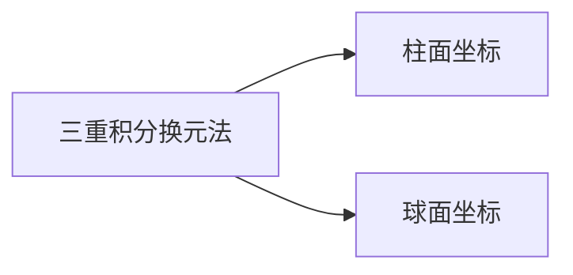

## 一、化三重积分为三次积分

1．＂先一后二＂法
设 $\Omega=\left\{(x, y, z) \mid z_{1}(x, y) \leq z \leq z_{2}(x, y),(x, y) \in D\right\}$
$\Omega$ 满足：
（1）在xoy面上 $D=\left\{(x, y) \mid y_{1}(x) \leq y \leq y_{2}(x), a \leq x \leq b\right\}$
（2）通过 $D$ 内的点且平行于 $z$轴的直线与 $\Omega$ 边界交点不多于两个。

先将 $x, y$ 看作定值，将 $f(x, y, z)$ 只看作 $z$ 的函数，则

$$
F(x, y)=\int_{z_{1}(x, y)}^{z_{2}(x, y)} f(x, y, z) d z
$$

再计算 $F(x, y)$ 在 $D$ 上的二重积分

$$
\begin{aligned}
& \iint_{D} F(x, y) d \sigma=\int_{a}^{b} d x \int_{y_{1}(x)}^{y_{2}(x)} F(x, y) d y \\
\therefore \iiint_{\Omega} f(x, y, z) d v & =\int_{a}^{b} d x \int_{y_{1}(x)}^{y_{2}(x)} d y \int_{z_{1}(x, y)}^{z_{2}(x, y)} f(x, y, z) d z .
\end{aligned}
$$

称为先积 $z$ 再积 $y$ 最后积 $x$ 的三次积分，记为 $z \rightarrow y \rightarrow x$ ．
需把一般区域先投影到xoy面得 $D$ ，再作平行于 $z$ 轴的直线求得 $z_{1}, z_{2}$ ，得到简单区域 $\Omega$ 。

若将 $\Omega$ 投影到 $z o x$ 面或 $y o z$ 面上，则有

$$
\begin{aligned}
& \iiint_{\Omega} f(x, y, z) d v=\int_{a}^{b} d x \int_{z_{1}(x)}^{z_{2}(x)} d z \int_{y_{1}(x, z)}^{y_{2}(x, z)} f(x, y, z) d y . \\
& \iiint_{\Omega} f(x, y, z) d v=\int_{c}^{d} d y \int_{z_{1}(y)}^{z_{2}(y)} d z \int_{x_{1}(y, z)}^{x_{2}(y, z)} f(x, y, z) d x .
\end{aligned}
$$

投影要求：
投到 $x o y$ 面，平行于 $z$ 轴的直线与 $\Omega$ 边界不多于两个交点．投到 $y o z$ 面，平行于 $x$ 轴的直线与 $\Omega$ 边界不多于两个交点．投到 $z o x$ 面，平行于 $y$ 轴的直线与 $\Omega$ 边界不多于两个交点．

---

## ＂先一后二＂法习例

例 1 化三重积分 $I=\iiint_{\Omega} f(x, y, z) d x d y d z$ 为三次积分，其中积分区域 $\Omega$ 为由曲面 $z=x^{2}+2 y^{2}$及 $z=2-x^{2}$ 所围成的闭区域。

例 2 化三重积分 $I=\iiint_{\Omega} f(x, y, z) d x d y d z$ 为三次积分，其中 积分区域 $\Omega$ 为由曲面 $z=x^{2}+y^{2}$ ， $y=x^{2}, y=1, z=0$ 所围成的空间闭区域。

例3 计算 $\iiint_{\Omega} \frac{d x d y d z}{(1+x+y+z)^{3}}$ ，其中 $\Omega$ 是由 $x=0, y=0, z=0$ ， $x+y+z=1$ 所围成的区域。

例 1 化三重积分 $I=\iiint_{\Omega} f(x, y, z) d x d y d z$ 为三次积分，其中积分区域 $\Omega$ 为由曲面 $z=x^{2}+2 y^{2}$及 $z=2-x^{2}$ 所围成的闭区域。

$$
x^{2}+y^{2} \leq 1,
$$

∴ 故 $\bar{\Omega} \int_{\text {的 }}^{1} d x \int_{\text {等式组形式为 }}^{\sqrt{1-x^{2}}}(x, y, z) d z$

例2 化三重积分 $I=\iiint_{\Omega} f(x, y, z) d x d y d z$ 为三次积分，其中积分区域
$\stackrel{1}{1} \Omega:\left\{\begin{array}{l}0 \leq z \leq x^{2}+y^{2} y^{2}, \\ D_{x y}\left\{\begin{array}{l}-1 \leq x \leq 1 \text { 斤围 } \\ x^{2} \leq y \leq 1\end{array}\right.\end{array}\right.$
$I=\int_{-1}^{1} d x \int_{x^{2}}^{1} d y \int_{0}^{x^{2}+y^{2}} f(x, y, z) d z^{1}$ ．
且 $0 \leq z \leq x^{2}+y^{2}$ ．
$D=\left\{(x, y) \mid x^{2} \leq y \leq 1\right.$,

例3 计算 $\iiint_{\Omega} \frac{d x d y d z}{(1+x+y+z)^{3}}$ ，其中 $\Omega$ 是由 $x=0, y=0, z=0$ ， $x+y+z=1$ 所围成的区域。

解 $\quad \Omega:\left\{\begin{array}{c}0 \leq z \leq 1-x-y \\ D:\left\{\begin{array}{c}0 \leq x \leq 1 \\ 0 \leq y \leq 1-x\end{array}\right.\end{array}\right.$

$$
\begin{aligned}
& \therefore \iiint_{\Omega} \frac{d x d y d z}{(1+x+y+z)^{3}} \\
& =\int_{0}^{1} d x \int_{0}^{1-x} d y \int_{0}^{1-x-y} \frac{1}{(1+x+y+z)^{3}} d z
\end{aligned}
$$

$$
\begin{aligned}
& \therefore \iiint_{\Omega} \frac{d x d y d z}{(1+x+y+z)^{3}}=\int_{0}^{1} d x \int_{0}^{1-x} d y \int_{0}^{1-x-y} \frac{1}{(1+x+y+z)^{3}} d z \\
& =\int_{0}^{1} d x \int_{0}^{1-x}-\left.\frac{1}{2(1+x+y+z)^{2}}\right|_{0} ^{1-x-y} d y \\
& =\int_{0}^{1} d x \int_{0}^{1-x}\left[-\frac{1}{8}+\frac{1}{2(1+x+y)^{2}}\right] d y \\
& =\left.\int_{0}^{1}\left[-\frac{1}{8} y-\frac{1}{2(1+x+y)}\right]\right|_{0} ^{1-x} d x=\int_{0}^{1}\left[-\frac{3}{8}+\frac{x}{8}+\frac{1}{2(1+x)}\right] d x \\
& =\left[-\frac{3}{8} x+\frac{1}{16} x^{2}+\frac{1}{2} \ln (1+x)\right]_{0}^{1}=\frac{1}{2} \ln 2-\frac{5}{16}
\end{aligned}
$$

---

## 2.＂先二后一＂法

（1）把积分区域 $\Omega$ 向某轴（例如 $z$ 轴）投影，得投影区间 $\left[c_{1}, c_{2}\right]$ ；
（2）对 $z \in\left[c_{1}, c_{2}\right]$ 用过 $z$ 轴且平行 $x o y$ 平面的平面去截 $\Omega$ ，得截面 $\boldsymbol{D}_{z}$ ；
（3） $\iiint_{\Omega} f(x, y, z) d x d y d z=\int_{c_{1}}^{c_{2}} d z \iint_{D_{z}} f(x, y, z) d x d y$用于 $f(x, y, z)=g(z)$ 或 $f(x, y, z)=g(x, y)$ ．

例 4 计算三重积分 $\iiint_{\Omega} z d x d y d z$ ，其中 $\Omega$ 为三个坐标面及平面 $x+y+z=1$ 所围成的闭区域．

例5 计算三重积分 $\iiint_{\Omega} z^{2} d x d y d z$ ，其中 $\Omega$ 是由椭球面 $\frac{x^{2}}{a^{2}}+\frac{y^{2}}{b^{2}}+\frac{z^{2}}{c^{2}}=1$ 所成的空间闭区域。

例 4 计算三重积分 $\iiint_{\Omega} z d x d y d z$ ，其中 $\Omega$ 为三个坐标面及平面 $x+y+z=1$ 所围成的闭区域．
解法 1 ＂先二后一＂法

$$
\begin{aligned}
& D_{z}=\{(x, y) \mid x+y \leq 1-z\} \quad x=1-z \quad\left\{\begin{array}{c}
0 \leq z \leq 1 \\
\Omega: D_{z}=\{(x, y) \mid x+y \leq 1-z\}
\end{array}\right. \\
& \iint_{D_{z}} d x d y=S_{D_{z}}=\frac{1}{2}(1-z)(1-z) \\
& \iiint_{\Omega} z d x d y d z=\int_{0}^{1} z d z \iint_{D_{z}} d x d y=\frac{1}{2} \int_{0}^{1} z(1-z)(1-z) d z=\frac{1}{24}
\end{aligned}
$$

解法2＂先一后二＂法

$$
\begin{aligned}
& \Omega:\left\{\begin{array}{l}
0 \leq z \leq 1-x-y \\
D:\left\{\begin{array}{c}
0 \leq x \leq 1 \\
0 \leq y \leq 1-x
\end{array}\right. \\
\iiint_{\Omega} z d x d y d z=\int_{0}^{1} x d x \int_{0}^{1-x} d y \int_{0}^{1-x-y} z d z \\
\quad=\int_{0}^{1} d x \int_{0}^{1-x} \frac{1}{2}(1-x-y)^{2} d y \\
\quad=-\frac{1}{6} \int_{0}^{1}(1-x)^{3} d x=\frac{1}{24}
\end{array}\right. \text { }
\end{aligned}
$$

例 5 计算三重积分 $\iiint_{\Omega} z^{2} d x d y d z$ ，其中 $\Omega$ 是由椭球面 $\frac{x^{2}}{a^{2}}+\frac{y^{2}}{b^{2}}+\frac{z^{2}}{c^{2}}=1$ 所成的空间闭区域。

$$
\begin{gathered}
\text { 解 } \iint_{D_{z}} d x d y=\pi \sqrt{a^{2}\left(1-\frac{z^{2}}{c^{2}}\right)} \cdot \sqrt{b^{2}\left(1-\frac{z^{2}}{c^{2}}\right)} \\
=\pi a b\left(1-\frac{z^{2}}{c^{2}}\right) \\
\Omega:\left\{\begin{array}{c}
-c \leq z \leq c \\
D_{z}\left\{(x, y) \left\lvert\, \frac{x^{2}}{a^{2}}+\frac{y^{2}}{b^{2}} \leq 1-\frac{z^{2}}{c^{2}}\right.\right\}
\end{array}\right.
\end{gathered}
$$

原式 $=\int_{-c}^{c} z^{2} d z \iint_{D_{z}} d x d y=\int_{-c}^{c} \pi a b\left(1-\frac{z^{2}}{c^{2}}\right) z^{2} d z=\frac{4}{15} \pi a b c^{3}$.

---

## 二、三重积分的轮换对称性

1．（两字母轮换）如果将 $x, y$ 换为 $y, x$ 积分域 $\Omega$ 不变，则

$$
\iiint_{\Omega} f\left(\underline{x, y, z) \mathrm{d} x \mathrm{~d} y \mathrm{~d} z=\iiint_{\Omega} f(\underline{y, x}, z) \mathrm{d} x \mathrm{~d} y \mathrm{~d} z .}\right.
$$

2．（三字母轮换）如果将 $x, y, z$ 换为 $y, z, x$ 积分域 $\Omega$ 不变，则

$$
\iiint_{\Omega} f(\underline{x, y, z}) \mathrm{d} x \mathrm{~d} y \mathrm{~d} z=\iiint_{\Omega} f(\underline{y, z, x}) \mathrm{d} x \mathrm{~d} y \mathrm{~d} z .
$$

3．（三字母轮换）如果将 $x, y, z$ 换为 $y, z, x$ 积分域 $\Omega$ 不变；当被积函数 $f(x, y, z)$ 中 $x, y, z$ 依次轮换，函数的形式不变；而 $f=f_{1}+f_{2}+f_{3}$ ，且 $x, y, z$ 依次轮换时，$f_{1}, f_{2}, f_{3}$ 依次轮换，则

$$
\begin{aligned}
& \iiint_{\Omega} f \mathrm{~d} x \mathrm{~d} y \mathrm{~d} z=3 \iiint_{\Omega} f_{1} \mathrm{~d} x \mathrm{~d} y \mathrm{~d} z \\
& =3 \iiint_{\Omega} f_{2} \mathrm{~d} x \mathrm{~d} y \mathrm{~d} z=3 \iiint_{\Omega} f_{3} \mathrm{~d} x \mathrm{~d} y \mathrm{~d} z
\end{aligned}
$$

例6 求 $I=\iiint_{\Omega}\left(l x^{2}+m y^{2}+n z^{2}\right) d x d y d z$ ，其中 $\Omega: x^{2}+y^{2}+z^{2} \leq a^{2}$ ．

例 7 求 $I=\iiint_{\frac{x^{2}}{a^{2}}+\frac{y^{2}}{b^{2}}+\frac{z^{2}}{c^{2}} \leq 1}\left(\frac{x^{2}}{a^{2}}+\frac{y^{2}}{b^{2}}+\frac{z^{2}}{c^{2}}\right) d v$ ．例 8 求 $I=\iiint_{\Omega} \frac{f(x)}{f(x)+f(y)+f(z)} d x d y d z$

其中 $\Omega: x^{2}+y^{2}+z^{2} \leq a^{2}, f$ 为正的连续函数．

例6 求 $I=\iiint_{\Omega}\left(l x^{2}+m y^{2}+n z^{2}\right) d x d y d z$ ，
其中 $\Omega: x^{2}+y^{2}+z^{2} \leq a^{2}$ ．
解 由轮换对称性可知，

$$
\begin{aligned}
& \iiint_{\Omega} x^{2} d x d y d z=\iiint_{\Omega} y^{2} d x d y d z=\iiint_{\Omega} z^{2} d x d y d z \\
\therefore I & =(l+m+n) \iiint_{\Omega} z^{2} d x d y d z \\
= & (l+m+n) \int_{-a}^{a} z^{2} d z \iiint_{x^{2}+y^{2} \leq a^{2}-z^{2}} d x d y \\
= & (l+m+n) \int_{-a}^{a} z^{2} \pi\left(a^{2}-z^{2}\right) d z=\frac{4}{15} \pi(l+m+n) a^{5}
\end{aligned}
$$

例 7 求 $I=\iiint_{\frac{x^{2}}{a^{2}}+\frac{y^{2}}{b^{2}}+\frac{z^{2}}{c^{2}} \leq 1}\left(\frac{x^{2}}{a^{2}}+\frac{y^{2}}{b^{2}}+\frac{z^{2}}{c^{2}}\right) d v$ ．
解 利用： $\iiint_{\frac{x^{2}}{a^{2}}+\frac{y^{2}}{b^{2}}+\frac{z^{2}}{c^{2}} \leq 1} z^{2} d v=\frac{4}{15} \pi a b c^{3}$ ．
由对称性知： $\iiint_{\Omega} \frac{z^{2}}{c^{2}} d v=\iiint_{\Omega} \frac{x^{2}}{a^{2}} d v=\iiint_{\Omega} \frac{y^{2}}{b^{2}} d v=\frac{4}{15} \pi a b c$

$$
\therefore \iiint_{\Omega}\left(\frac{x^{2}}{a^{2}}+\frac{y^{2}}{b^{2}}+\frac{z^{2}}{c^{2}}\right) d v=\frac{4}{5} \pi a b c
$$

例 8 求 $I=\iiint_{\Omega} \frac{f(x)}{f(x)+f(y)+f(z)} d x d y d z$
其中 $\Omega: x^{2}+y^{2}+z^{2} \leq a^{2}, f$ 为正的连续函数．

$$
\text { 解 } \begin{aligned}
\text { 原式 } & =\iiint_{\Omega} \frac{f(y)}{f(x)+f(y)+f(z)} d x d y d z \\
& =\iiint_{\Omega} \frac{f(z)}{f(x)+f(y)+f(z)} d x d y d z \\
& =\frac{1}{3} \iiint_{\Omega} \frac{f(x)+f(y)+f(z)}{f(x)+f(y)+f(z)} d x d y d z=\frac{4}{9} \pi a^{3} .
\end{aligned}
$$

---

## 三、利用积分区域的对称性与函数的奇偶性化简三重积分计算

使用对称性时应注意：
1 ．积分区域关于坐标面的对称性；
2．被积函数在积分区域上的关于三个坐标轴的奇偶性。

一般地，当积分区域 $\Omega$ 关于 $x o y$ 平面对称，且被积函数 $f(x, y, z)$ 是关于 $z$ 的奇函数，则三重积分为零，若被积函数 $f(x, y, z)$ 是关于 $z$ 的偶函数，则三重积分为 $\Omega$ 在 $x o y$ 平面上方的半个闭区域的三重积分的两倍。
$1 . \Omega$ 关于 $x o y$ 面对称，则

$$
\iiint_{\Omega} f(x, y, z) d v= \begin{cases}2 \iiint_{\Omega_{ \pm}} f(x, y, z) d v & f(x, y,-z)=f(x, y, z) \\ 0 & f(x, y,-z)=-f(x, y, z)\end{cases}
$$

$2 . \Omega$ 关于 $y o z$ 面对称，则

$$
\iiint_{\Omega} f(x, y, z) d v= \begin{cases}2 \iiint_{\Omega_{\text {前 }}} f(x, y, z) d v & f(-x, y, z)=f(x, y, z) \\ 0 & f(-x, y, z)=-f(x, y, z)\end{cases}
$$

$3 . \Omega$ 关于 $z o x$ 面对称，则

$$
\iiint_{\Omega} f(x, y, z) d v= \begin{cases}2 \iiint_{\Omega_{\text {右 }} f(x, y, z) d v} & f(x,-y, z)=f(x, y, z) \\ 0 & f(x,-y, z)=-f(x, y, z)\end{cases}
$$

例 9 计算 $\iiint_{\Omega}(x+y+z)^{2} d x d y d z$ ，其中 $\Omega$ 是由抛物面 $z=x^{2}+y^{2}$ 和球面 $x^{2}+y^{2}+z^{2}=2$ 所围成的空间闭区域．

例 10 求 $\iiint_{\Omega}(x+y+z) \mathrm{d} x \mathrm{~d} y \mathrm{~d} z$ ，其中 $\Omega$ 为球面 $x^{2}+y^{2}+z^{2}=1$ 所围成的区域。

例 9 计算 $\iiint_{\Omega}(x+y+z)^{2} d x d y d z$ ，其中 $\Omega$ 是由抛物面 $z=x^{2}+y^{2}$ 和球面 $x^{2}+y^{2}+z^{2}=2$ 所围成的空间闭区域。

解 $\because(x+y+z)^{2}$

$$
=x^{2}+y^{2}+z^{2}+2(x y+y z+z x)
$$

其中 $x y+y z$ 是关于 $y$ 的奇函数，
且 $\Omega$ 关于 $z o x$ 面对称，$\therefore \iiint_{\Omega}(x y+y z) d v=0$ ，同理，$z x$ 是关于 $x$ 的奇函数，且 $\Omega$ 关于 $y o z$ 面对称，

$$
\begin{aligned}
& \therefore \iiint_{\Omega} x z d v=0, \\
& \text { 则 } I=\iiint_{\Omega}(x+y+z)^{2} d x d y d z \\
&=\iiint_{\Omega}\left(x^{2}+y^{2}+z^{2}\right) d x d y d z \\
&=\iiint_{\Omega}\left(r^{2}+z^{2}\right) r d r d \theta d z \\
&=\int_{0}^{2 \pi} d \theta \int_{0}^{1} d r \int_{r^{2}}^{\sqrt{2-r^{2}}} r\left(r^{2}+z^{2}\right) d z \\
&=\frac{\pi}{60}(96 \sqrt{2}-89) .
\end{aligned}
$$

$$
\begin{aligned}
& D: x^{2}+y^{2} \leq 1 \\
& r^{2} \leq z \leq \sqrt{2-r^{2}}
\end{aligned}
$$

例 10 求 $\iiint_{\Omega}(x+y+z) \mathrm{d} x \mathrm{~d} y \mathrm{~d} z$ ，
其中 $\Omega$ 为球面 $x^{2}+y^{2}+z^{2}=1$ 所围成的区域。
解 由轮换对称有

$$
\iiint_{\Omega} x \mathrm{~d} x \mathrm{~d} y \mathrm{~d} z=\iiint_{\Omega} y \mathrm{~d} x \mathrm{~d} y \mathrm{~d} z=\iiint_{\Omega} z \mathrm{~d} x \mathrm{~d} y \mathrm{~d} z
$$

由奇偶对称性有 $\iiint_{\Omega} x \mathrm{~d} x \mathrm{~d} y \mathrm{~d} z=0$

$$
\therefore \iiint_{\Omega}(x+y+z) \mathrm{d} x \mathrm{~d} y \mathrm{~d} z=3 \iiint_{\Omega} x \mathrm{~d} x \mathrm{~d} y \mathrm{~d} z=0 .
$$

---

## 三重积分的定义和计算

（计算时将三重积分化为三次积分）
方法1：先一后二法，
方法2：先二后一法（截面法）
（当被积函数为单变量函数时，一般用此法）在直角坐标系下的体积元素

$$
d v=d x d y d z
$$

注意：利用对称性简化运算

---

## 一、在柱面坐标下计算三重积分

导学及问题讨论
设由曲面 $z=x^{2}+y^{2}, z=1$ 围城的空间立体，体密度为 $e^{-x^{2}-y^{2}}$ ，求其质量？
解 $M=\iiint_{\Omega} e^{-x^{2}-y^{2}} d v$
如何计算该三重积分？
$M=\iiint_{\Omega} e^{-x^{2}-y^{2}} d v=\iint_{D_{x y}} e^{-x^{2}-y^{2}} d x d y \int_{x^{2}+y^{2}}^{1} d z=\int_{-1}^{1} d x \int_{-\sqrt{1-x^{2}}}^{\sqrt{1-x^{2}}} e^{-x^{2}-y^{2}} d y \int_{x^{2}+y^{2}}^{1} d z$
$M=\int_{0}^{1} d z \iint_{D_{z}} e^{-x^{2}-y^{2}} d x d y$ 计算较繁琐甚至无法计算，怎么办？

可否想到、怎么想到？变量 $r 、 \theta 、 z$
的几何意义？

可否令变换 $\mathbf{T}:\left\{\begin{array}{l}x=r \cos \theta \\ y=r \sin \theta \\ z=z \circ \bigcirc\end{array}\right\}\left(\begin{array}{l}\text { 么想到？} \\ \text { 变量 } \boldsymbol{r}, ~ \theta, \boldsymbol{z} \\ \text { 的几何意义？}\end{array}\right.$

$$
M=\iiint_{\Omega} e^{-x^{2}-y^{2}} d v=\int_{0}^{2 \pi} d \theta \int_{0}^{1} e^{-r^{2}} \cdot r d r d \theta \int_{r^{2}}^{1} d z=2 \pi \int_{0}^{1} e^{-r^{2}} \cdot\left(1-r^{2}\right) r d r d \theta=\frac{\pi}{e}
$$

---

## 1.柱面坐标系及其坐标面

设 $M(x, y, z)$ 为空间内一点，点 P 为点 $M$ 在 $x o y$ 面上的投影，记线段 $O P$ 的长度为 $r$ ，记从 $x$ 轴正向按逆时针转到射线 $O P$ 的角度为 $\theta$ ，则点 $M(x, y, z)$ 与数序 $(r, \theta, z)$ 是一一对应的，称这样的三个数 $r, \theta, z$ 为 $M$ 点的柱面坐标。

2．柱面坐标（ $r, \theta, z$ ）与直角坐标（ $x, y, z$ ）的关系容易得出柱面坐标 $\left\{\begin{array}{l}x=r \cos \theta \\ y=r \sin \theta \\ z=z\end{array} \Leftrightarrow\left\{\begin{array}{l}r=\sqrt{x^{2}+y^{2}} \\ \theta=\tan \frac{y}{x} \\ z=z\end{array}\right.\right.$

由定义可知点 $M$ 的柱面坐标 $r, \theta, z$ 的取值范围分别是 $r: 0 \leq r<+\infty, \quad \theta: 0 \leq \theta \leq 2 \pi, \quad z:-\infty<z<+\infty$ ．

三坐标面分别为
$r$ 为常数 ⟹ 圆柱面；
$\theta$ 为常数 ⟶ 半平面；
$z$ 为常数 ⟹ 平面．

---

## 柱面坐标下的三次积分

在柱坐标系下 用以下曲面分割积分区域：
$r=r_{i}$（圆柱面）$), \theta=\theta_{i}$（半平面）,$z=z_{i}$（平面）.柱面坐标系中的体积元素为

$$
\begin{gathered}
d v=d r \cdot r d \theta \cdot d z=r d r d \theta d z \\
\therefore \iiint_{\Omega} f(x, y, z) d x d y d z \\
=\iiint_{\Omega} f(r \cos \theta, r \sin \theta, z) r d r d \theta d z
\end{gathered}
$$

积分次序通常为 $z \rightarrow r \rightarrow \theta$ ．
注意：必须把区域、被积函数及体积元素一次全用柱坐标表示。

$$
\begin{aligned}
& \therefore \iiint_{\Omega} f(x, y, z) d x d y d z \\
& =\iiint_{\Omega} f(r \cos \theta, r \sin \theta, z) r d r d \theta d z \\
& =\int_{\alpha}^{\beta} d \theta \int_{r_{1}(\theta)}^{r_{2}(\theta)} r d r \int_{z_{1}(r, \theta)}^{z_{2}(r, \theta)} f(r \cos \theta,
\end{aligned}
$$

即与＂先一后二法＂一致，其中当投影区域为圆形域时，后二是在极坐标 系下计算的．

---

## 利用柱面坐标系计算三重积分习例

例 1 计算 $I=\iiint_{\Omega} z d x d y d z$ ，其中 $\Omega$ 是球面 $x^{2}+y^{2}+z^{2}=4$ 与抛物面 $x^{2}+y^{2}=3 z$ 所围的立体．

例2计算三重积分 $\iiint_{\Omega} z \sqrt{x^{2}+y^{2}} \mathrm{~d} x \mathrm{~d} y \mathrm{~d} z$ ，其中 $\Omega$ 由柱面 $x^{2}+y^{2}=2 x$ 及平面 $z=0, z=a(a>0), y=0$ 所围成半圆柱体．

例3 计算 $\iiint_{\Omega} \frac{\boldsymbol{e}^{z}}{\sqrt{\boldsymbol{x}^{2}+\boldsymbol{y}^{2}}} \boldsymbol{d x d y d z}, \Omega$ 由 $z=\sqrt{x^{2}+y^{2}}, z=1, z=2$ 围成。例4 计算 $\int_{0}^{2} d x \int_{0}^{\sqrt{2 x-x^{2}}} d y \int_{0}^{a} z \sqrt{x^{2}+y^{2}} d z$ ．

例 1 计算 $I=\iiint_{\Omega} z d x d y d z$ ，其中 $\Omega$ 是球面 $x^{2}+y^{2}+z^{2}=4$ 与抛物面 $x^{2}+y^{2}=3 z$ 所围的立体．
解 在 $x o y$ 面上的投影区域为 $x^{2}+y^{2} \leq 3$
则 $\Omega=\left\{(r, \theta, z) \left\lvert\, \frac{r^{2}}{3} \leq z \leq \sqrt{4-r^{2}}\right., 0 \leq r \leq \sqrt{3}, 0 \leq \theta \leq 2 \pi\right\}$

$$
\begin{aligned}
\therefore I & =\iiint_{\Omega} z r d r d \theta d z \\
& =\int_{0}^{2 \pi} d \theta \int_{0}^{\sqrt{3}} d r \int_{\frac{r^{2}}{3}}^{\sqrt{4-r^{2}}} r \cdot z d z \\
& =\frac{13}{4} \pi
\end{aligned}
$$

例2 计算三重积分 $\iiint_{\Omega} z \sqrt{x^{2}+y^{2}} \mathrm{dxdydz}$ 其中 $\Omega$ 为由柱面 $x^{2}+y^{2}=2 x$ 及平面 $z=0, z=a(a>0), y=0$ 所围成半圆解 在柱面坐标系下 $\Omega_{\text {柱 }}:\left\{\begin{array}{l}0 \leq z \leq \boldsymbol{a} \\ 0 \leq \theta \leq \frac{\boldsymbol{\pi}}{\mathbf{2}} \\ 0 \leq \boldsymbol{r} \leq \mathbf{2} \cos \theta\end{array}\right.$

$$
\begin{aligned}
\text { 原式 } & =\iiint_{\Omega} z r^{2} \mathrm{~d} r \mathrm{~d} \theta \mathrm{~d} z \\
& =\int_{0}^{a} z \mathrm{~d} z \int_{0}^{\pi / 2} \mathrm{~d} \theta \int_{0}^{2 \cos \theta} r^{2} \mathrm{~d} r \\
& =\frac{4 a^{2}}{3} \int_{0}^{\pi / 2} \cos ^{3} \theta \mathrm{~d} \theta=\frac{8}{9} a^{3} .
\end{aligned}
$$

$\mathrm{d} v=r \mathrm{~d} r \mathrm{~d} \theta \mathrm{~d} z$

例3计算 $\iiint_{\Omega} \frac{e^{z}}{\sqrt{x^{2}+y^{2}}} d x d y d z, \Omega$ 由 $z=\sqrt{x^{2}+y^{2}}, z=1, z=2$ 围成。
解法1 $\Omega=\Omega_{1}+\Omega_{2}=\left\{(x, y, z) \mid 1 \leq z \leq 2, x^{2}+y^{2} \leq 1\right\}$

$$
\begin{aligned}
& +\left\{(x, y, z) \mid \sqrt{x^{2}+y^{2}} \leq z \leq 2,1 \leq x^{2}+y^{2} \leq 4\right\} \\
= & \{(r, \theta, z) \mid 1 \leq z \leq 2,0 \leq r \leq 1,0 \leq \theta \leq 2 \pi\} \\
+ & \{(r, \theta, z) \mid r \leq z \leq 2,1 \leq r \leq 2,0 \leq \theta \leq 2 \pi\} \\
\therefore & \text { 原式 }=\iiint_{\Omega} \frac{e^{z}}{r} r d r d \theta d z \\
= & \int_{0}^{2 \pi} d \theta \int_{0}^{1} d r \int_{1}^{2} e^{z} d z+\int_{0}^{2 \pi} d \theta \int_{1}^{2} d r \int_{r}^{2} e^{z} d z \\
= & 2 \pi e^{2} .
\end{aligned}
$$

---

## 解法2

$$
\begin{aligned}
\Omega=\Omega_{\text {大 }}-\Omega_{\text {小 }} & =\left\{(x, y, z) \mid \sqrt{x^{2}+y^{2}} \leq z \leq 2, x^{2}+y^{2} \leq 4\right\} \\
& -\left\{(x, y, z) \mid \sqrt{x^{2}+y^{2}} \leq z \leq 1, x^{2}+y^{2} \leq 1\right\}
\end{aligned}
$$

$$
\begin{aligned}
& =\{(r, \theta, z) \mid r \leq z \leq 2,0 \leq r \leq 2,0 \leq \theta \leq 2 \pi\} \\
& -\{(r, \theta, z) \mid r \leq z \leq 1,0 \leq r \leq 1,0 \leq \theta \leq 2 \pi\}
\end{aligned}
$$

$$
\begin{aligned}
& \therefore \text { 原式 }=\iiint_{\Omega} \frac{e^{z}}{r} r d r d \theta d z \\
& =\int_{0}^{2 \pi} d \theta \int_{0}^{2} d r \int_{r}^{2} e^{z} d z-\int_{0}^{2 \pi} d \theta \int_{0}^{1} d r \int_{r}^{1} e^{z} d z \\
& =2 \pi e^{2} .
\end{aligned}
$$

解法3＂先二后一＂法

$$
\begin{aligned}
1 \leq z & \leq 2 \\
D_{z} & : x^{2}+y^{2} \leq z^{2} \\
\text { 原式 } & =\int_{1}^{2} e^{z} d z \iint_{D_{z}} \frac{1}{\sqrt{x^{2}+y^{2}}} d x d y \\
& =\int_{1}^{2} e^{z} d z \iint_{D_{z}} d r d \theta \\
& =\int_{1}^{2} e^{z} d z \int_{0}^{2 \pi} d \theta \int_{0}^{z} d r=2 \pi \int_{1}^{2} z e^{z} d z \\
& =2 \pi e^{2}
\end{aligned}
$$

例4 计算 $\int_{0}^{2} d x \int_{0}^{\sqrt{2 x-x^{2}}} d y \int_{0}^{a} z \sqrt{x^{2}+y^{2}} d z$ ．解 $\Omega: 0 \leq z \leq a, 0 \leq y \leq \sqrt{2 x-x^{2}}, 0 \leq x \leq 2$ ．

化为柱坐标计算
$\Omega=\{(r, \theta, z) \mid 0 \leq z \leq a$,

$$
\left.0 \leq r \leq 2 \cos \theta, \quad 0 \leq \theta \leq \frac{\pi}{2}\right\}
$$

$$
\begin{aligned}
& \therefore \text { 原式 }=\iiint_{\Omega} z \sqrt{x^{2}+y^{2}} d x d y d z=\iiint_{\Omega} z r^{2} d r d \theta d z \\
& \quad=\int_{0}^{\frac{\pi}{2}} d \theta \int_{0}^{2 \cos \theta} r^{2} d r \int_{0}^{a} z d z=\frac{a^{2}}{2} \int_{0}^{\frac{\pi}{2}} \frac{8}{3} \cos ^{3} \theta d \theta=\frac{8}{9} a^{2} .
\end{aligned}
$$

利用柱坐标计算三重积分的一般步骤

$$
\begin{aligned}
& \iiint_{\Omega} f(x, y, z) \mathrm{d} x \mathrm{~d} y \mathrm{~d} z=\iiint_{\Omega} F(r, \theta, z) r \mathrm{~d} r \mathrm{~d} \theta \mathrm{~d} z \\
& \quad=\int_{\alpha}^{\beta} d \theta \int_{r_{1}(\theta)}^{r_{2}(\theta)} r d r \int_{z_{1}(r, \theta)}^{z_{2}(r, \theta)} f(r \cos \theta, r \sin \theta, z) d z
\end{aligned}
$$

其中 $F(r, \theta, z)=f(r \cos \theta, r \sin \theta, z)$
适用范围：
1）积分域用柱面坐标表示时方程简单；
2）被积函数用柱面坐标表示时变量互相分离．

---

## 二、在球坐标下计算三重积分

导学及问题讨论
设空间立体为 $x^{2}+y^{2}+z^{2} \leq 1$ ，体密度为 $\frac{e^{-x^{2}-y^{2}-z^{2}}}{\sqrt{x^{2}+y^{2}+z^{2}}}$ ，求其质量？
解 $M=\iiint_{\Omega} \frac{e^{-x^{2}-y^{2}-z^{2}}}{\sqrt{x^{2}+y^{2}+z^{2}}} d v$ 如何计算该三重积分？
直角坐标下三次积分有：

$$
M=\iiint_{\Omega} e^{-x^{2}-y^{2}-z^{2}} d v=\int_{-1}^{1} d x \int_{-\sqrt{1-x^{2}}}^{\sqrt{1-x^{2}}} d y \int_{-\sqrt{1-x^{2}-y^{2}}}^{\sqrt{1-x^{2}-y^{2}}} \frac{e^{-x^{2}-y^{2}-z^{2}}}{\sqrt{x^{2}+y^{2}+z^{2}}} d z
$$

＂先二后一＂有：

$$
M=\int_{-1}^{1} d z \iint_{D_{z}} \frac{e^{-x^{2}-y^{2}-z^{2}}}{\sqrt{x^{2}+y^{2}+z^{2}}} d x d y
$$

柱面坐标下三次积分有：

$$
M=\int_{0}^{2 \pi} d \theta \int_{0}^{1} r d r \int_{-\sqrt{1-r^{2}}}^{\sqrt{1-r^{2}}} \frac{e^{-r^{2}-z^{2}}}{\sqrt{r^{2}+z^{2}}} d z
$$

计算较繁琐甚至无法计算，怎么办？

---

## 1.球面坐标系及坐标面

设 $M(x, y, z)$ 为空间一点，记 $\rho$ 为原点 $O$ 与点 $M$ 间的距离，$\varphi$ 为有向线段 $O M$与 $z$ 轴正向所夹的角，$\theta$ 为从正 $z$ 轴来看自 $x$ 轴按逆时针方向转到有向线段 $O P$ 的角，点 $M$ 与这三个有次序的数 $\rho, \varphi, \theta$一一对应，称有序数 $\rho, \varphi, \theta$ 为点 $M$ 的球面坐标。

2．球面坐标（ $\rho, \theta, \varphi$ ）与直角坐标（ $x, y, z$ ）的关系容易得出球面坐标 $\left\{\begin{array}{l}x=\rho \sin \varphi \cos \theta \\ y=\rho \sin \varphi \sin \theta \\ z=\rho \cos \varphi\end{array} \Leftrightarrow\left\{\begin{array}{l}\rho=\sqrt{x^{2}+y^{2}+z^{2}} \\ \varphi=\arccos \frac{z}{\sqrt{x^{2}+y^{2}+z^{2}}} \\ \theta=\arctan \frac{y}{x}\end{array}\right.\right.$

由定义可知点 $M$ 的球面坐标 $\rho 、 \varphi 、 \theta$ 的取值范围是

$$
\mathbf{0} \leq \rho<+\infty, \quad \mathbf{0} \leq \varphi \leq \pi, \quad \mathbf{0} \leq \theta \leq 2 \pi .
$$

球面坐标系的三坐标面分别为
$\rho$ 为常数 ⟶ 球 面；
$\boldsymbol{\varphi}$ 为常数 ⟹ 圆锥面；
$\theta$ 为常数 ⟶ 半平面．

---

## 球面坐标下的三次积分

球面坐标系中的体积微元的计算

$$
\begin{aligned}
& \therefore I=\iiint_{\Omega} f(x, y, z) d x d y d z= \\
& \iiint_{\Omega} f(\rho \sin \varphi \cos \theta, \rho \sin \varphi \sin \theta, \rho \cos \varphi) \rho^{2} \sin \varphi d \rho d \varphi d \theta
\end{aligned}
$$

注意：必须把区域、被积函数及体积元素一次全用球坐标表示．
在球面坐标系中三次积分次序通常为：$\rho \rightarrow \varphi \rightarrow \theta$ ．

若 $\Omega$ 的边界为包围原点在内 的闭曲面 $\rho=\rho(\theta, \varphi)$ ，则

$$
I=\int_{0}^{2 \pi} d \theta \int_{0}^{\pi} \sin \varphi d \varphi \int_{0}^{\rho(\theta, \varphi)} f(\rho \sin \varphi \cos \theta, \rho \sin \varphi \sin \theta, \rho \cos \varphi) \rho^{2} d \rho
$$

一般地有，取积分次序为 $\rho \rightarrow \varphi \rightarrow \theta$ ，则有

$$
I=\int_{\alpha}^{\beta} d \theta \int_{\varphi_{1}}^{\varphi_{2}} \sin \varphi d \varphi \int_{\rho_{1}(\theta, \varphi)}^{\rho_{2}(\theta, \varphi)} f(\rho \sin \varphi \cos \theta, \rho \sin \varphi \sin \theta, \rho \cos \varphi) \rho^{2} d \rho
$$

例5 计算 $\iint_{\Omega} \sqrt{x^{2}+y^{2}+z^{2}} d x d y d z, \Omega$ 由 $x^{2}+y^{2}+z^{2}=z$ 围成。
例 6 求曲面 $x^{2}+y^{2}+z^{2} \leq 2 a^{2}$ 与 $z \geq \sqrt{x^{2}+y^{2}}$
所围成的立体体积．
例7 计算 $\iiint_{\Omega} z^{2} d v$ ，
$\Omega$ 由 $x^{2}+y^{2}+z^{2} \leq R^{2}$ 与 $x^{2}+y^{2}+z^{2} \leq 2 R z$ 围成。
例8 设 $f(u)$ 具有连续的导数，且 $f(0)=0$ ，求

$$
\lim _{t \rightarrow 0^{+}} \frac{1}{\pi t^{4}} \iiint_{x^{2}+y^{2}+z^{2} \leq t^{2}} f\left(\sqrt{x^{2}+y^{2}+z^{2}}\right) d x d y d z .
$$

例9 计算 $\iiint_{\Omega} f(x, y, z) d v$ ，其中 $\Omega: x^{2}+y^{2}+z^{2} \leq 1$ ，

$$
f(x, y, z)= \begin{cases}\sqrt{x^{2}+y^{2}} & z>\sqrt{x^{2}+y^{2}} \\ 0 & 0 \leq z \leq \sqrt{x^{2}+y^{2}} \\ \sqrt{x^{2}+y^{2}+z^{2}} & z<0\end{cases}
$$

例5 计算 $\iiint_{\Omega} \sqrt{x^{2}+y^{2}+z^{2}} d x d y d z, \Omega$ 由 $x^{2}+y^{2}+z^{2}=z$ 围成。解 $\Omega$ 由球面围成，采用球坐标

$$
\begin{aligned}
\Omega=\{(\rho, \varphi, \theta) \mid & 0 \leq \rho \leq \cos \varphi, \\
0 & \leq \varphi \leq \frac{\pi}{2} \\
0 & \leq \theta \leq 2 \pi\}
\end{aligned}
$$

$$
\begin{aligned}
& \therefore \iiint_{\Omega} \sqrt{x^{2}+y^{2}+z^{2}} d x d y d z=\iiint_{\Omega} \rho \cdot \rho^{2} \sin \varphi d \rho d \varphi d \theta \\
& \quad=\int_{0}^{2 \pi} d \theta \int_{0}^{\frac{\pi}{2}} \sin \varphi d \varphi \int_{0}^{\cos \varphi} \rho^{3} d \rho=\frac{\pi}{10}
\end{aligned}
$$

例 6 求曲面 $x^{2}+y^{2}+z^{2} \leq 2 a^{2}$ 与 $z \geq \sqrt{x^{2}+y^{2}}$所围 成的立体体积．

解 $\Omega$ 由锥面和球面围成，采用球面坐标，
由 $x^{2}+y^{2}+z^{2}=2 a^{2}$

$$
\Rightarrow \rho=\sqrt{2} a,
$$

$z=\sqrt{x^{2}+y^{2}} \Rightarrow \varphi=\frac{\pi}{4}$,
$\Omega: \quad 0 \leq \rho \leq \sqrt{2} a, \quad 0 \leq \varphi \leq \frac{\pi}{4}, \quad 0 \leq \theta \leq 2 \pi$,

由三重积分的性质知 $V=\iiint_{\Omega} d x d y d z$ ，

$$
\begin{aligned}
& \Omega_{\text {球 }}:\left\{\begin{array}{l}
0 \leq \rho \leq \sqrt{2} a \\
0 \leq \varphi \leq \frac{\pi}{4} \\
0 \leq \theta \leq 2 \pi
\end{array}\right. \\
& V=\int_{0}^{2 \pi} d \theta \int_{0}^{\frac{\pi}{4}} d \varphi \int_{0}^{\sqrt{2} a} \rho^{2} \sin \varphi d \rho \\
& =2 \pi \int_{0}^{\frac{\pi}{4}} \sin \varphi \cdot \frac{(\sqrt{2} a)^{3}}{3} d \varphi=\frac{4}{3} \pi(\sqrt{2}-1) a^{3} .
\end{aligned}
$$

（2）例7 计算 $\iiint_{\Omega} z^{2} d v$ ，
$\Omega$ 由 $x^{2}+y^{2}+z^{2} \leq R^{2}$ 与 $x^{2}+y^{2}+z^{2} \leq 2 R z$ 围成．
解法1 $\boldsymbol{\Omega}=\boldsymbol{\Omega}_{\mathbf{1}}+\boldsymbol{\Omega}_{\mathbf{2}}$

$$
\begin{aligned}
= & \left\{0 \leq \rho \leq R, 0 \leq \varphi \leq \frac{\pi}{3}, 0 \leq \theta \leq 2 \pi\right\} \\
+ & \left\{0 \leq \rho \leq 2 R \cos \varphi, \frac{\pi}{3} \leq \varphi \leq \frac{\pi}{2}, 0 \leq \theta \leq 2 \pi\right\} \\
\therefore & \iiint_{\Omega} z^{2} d v=\iiint_{\Omega} \rho^{2} \cos ^{2} \varphi \rho^{2} \sin \varphi d \rho d \varphi d \theta \\
& =\int_{0}^{2 \pi} d \theta \int_{0}^{\frac{\pi}{3}} \cos ^{2} \varphi \sin \varphi d \varphi \int_{0}^{R} \rho^{4} d \rho \\
& +\int_{0}^{2 \pi} d \theta \int_{\frac{\pi}{3}}^{\frac{\pi}{2}} \cos ^{2} \varphi \sin \varphi d \varphi \int_{0}^{2 R \cos \varphi} \rho^{4} d \rho=\frac{59}{480} \pi R^{5} .
\end{aligned}
$$

解法2＂先二后一＂法

$$
\begin{aligned}
& \Omega=\Omega_{1}+\Omega_{2} \\
& =\left\{0 \leq z \leq \frac{R}{2}, D_{z 1}: x^{2}+y^{2} \leq 2 R z-z^{2}\right\} \\
& +\left\{\frac{R}{2} \leq z \leq R, D_{z 2}: x^{2}+y^{2} \leq R^{2}-z^{2}\right\} \\
& \therefore \iiint_{\Omega} z^{2} d v=\int_{0}^{\frac{R}{2}} z^{2} d z \iint_{D_{z 1}} d x d y+\int_{\frac{R}{2}}^{R} z^{2} d z \iint_{D_{z 2}} d x d y \\
& =\int_{0}^{\frac{R}{2}} z^{2} \pi\left(2 R z-z^{2}\right) d z+\int_{\frac{R}{2}}^{R} z^{2} \pi\left(R^{2}-z^{2}\right) d z=\frac{\mathbf{5 9}}{\mathbf{4 8 0}} \pi R^{5} .
\end{aligned}
$$

---

## 解法3＂柱面坐标＂法

在xoy面上的投影区域为 $x^{2}+y^{2} \leq \frac{3}{4} R^{2}$

$$
\begin{gathered}
R-\sqrt{R^{2}-r^{2}} \leq z \leq \sqrt{R^{2}-r^{2}} \\
\therefore \iiint_{\Omega} z^{2} d v=\int_{0}^{2 \pi} d \theta \int_{0}^{\frac{\sqrt{3} R}{2}} d r \int_{R-\sqrt{R^{2}-r^{2}}}^{\sqrt{R^{2}-r^{2}}} z^{2} r d z
\end{gathered}
$$

三重积分的计算关键在于选取适当的坐标系，确定单积分的积分上下限。

通常 $\Omega$ 是球形域或球与圆锥面围成时用球坐标， $\Omega$ 是圆柱形或投影域为圆时用柱坐标．

例8 设 $f(u)$ 具有连续的导数，且 $f(0)=0$ ，求

$$
\lim _{t \rightarrow 0^{+}} \frac{1}{\pi t^{4}} \underset{x^{2}+y^{2}+z^{2} \leq t^{2}}{\iiint^{2}} f\left(\sqrt{x^{2}+y^{2}+z^{2}}\right) d x d y d z .
$$

解 利用球面坐标得

$$
\begin{aligned}
\text { 原式 } & =\lim _{t \rightarrow 0^{+}} \frac{1}{\pi t^{4}} \int_{0}^{2 \pi} d \theta \int_{0}^{\pi} \sin \varphi d \varphi \int_{0}^{t} f(\rho) \rho^{2} d \rho \\
& =\lim _{t \rightarrow 0^{+}} \frac{4 \pi \int_{0}^{t} \rho^{2} f(\rho) d \rho}{\pi t^{4}}=\lim _{t \rightarrow 0^{+}} \frac{4 t^{2} f(t)}{4 t^{3}} \\
& =\lim _{t \rightarrow 0^{+}} \frac{f(t)}{t}=\lim _{t \rightarrow 0^{+}} f^{\prime}(t)=f^{\prime}(0) .
\end{aligned}
$$

例9 计算 $\iiint_{\Omega} f(x, y, z) d v, \Omega: x^{2}+y^{2}+z^{2} \leq 1$ ，

$$
f(x, y, z)= \begin{cases}\sqrt{x^{2}+y^{2}} & z>\sqrt{x^{2}+y^{2}} \\ 0 & 0 \leq z \leq \sqrt{x^{2}+y^{2}} \\ \sqrt{x^{2}+y^{2}+z^{2}} & z<0\end{cases}
$$

解

$$
\begin{aligned}
& \iiint_{\Omega} f(x, y, z) d v=\iiint_{\Omega_{1}} \sqrt{x^{2}+y^{2}} d v+\iiint_{\Omega_{2}} \sqrt{x^{2}+y^{2}} \\
& =\int_{0}^{2 \pi} d \theta \int_{0}^{\pi} d \varphi \int_{0}^{1} \rho \sin \varphi \cdot \rho^{2} \sin \varphi d \rho \\
& \quad+\int_{0}^{2 \pi} d \theta \int_{\frac{\pi}{2}}^{\pi} d \varphi \int_{0}^{1} \rho \cdot \rho^{2} \sin \varphi d \rho=\frac{\pi^{2}}{16}+\frac{5 \pi}{8} .
\end{aligned}
$$

---

## 三、小结

三重积分换元法

（1）柱面坐标的体积元素

$$
d x d y d z=r d r d \theta d z
$$

（2）球面坐标的体积元素

$$
d x d y d z=\rho^{2} \sin \varphi d \rho d \theta d \varphi
$$

---

## 三重积分的计算小结

| 坐标系 | 体积元素 | 适用情况 |
| :---: | :---: | :---: |
| 直角坐标系 | $\mathrm{d} x \mathrm{~d} y \mathrm{~d} z$ |  |
| 柱面坐标系 | $r \mathrm{~d} r \mathrm{~d} \theta \mathrm{~d} z$ |  |
| 球面坐标系 | $\rho^{2} \sin \varphi \mathrm{~d} \rho \mathrm{~d} \varphi \mathrm{~d} \theta$ |  |

其它换元法
说明：
三重积分类似于二重积分也可以利用对称性计算。
